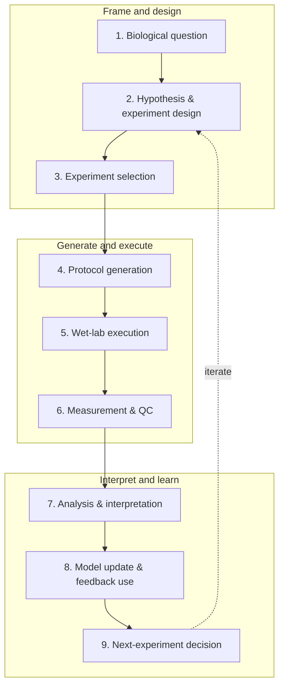

<!--
  Awesome Autonomous Biology · English README editorial shell for v0.2.

  Integration contract:
  - Human editors maintain sections outside AAB:* markers.
  - The generator writes statistics and resource records only inside AAB:* markers.
  - Counts that can be derived from data must not be hard-coded outside generated regions.
  - Publishing links are resolved from config/project.yml during repository integration.
-->

<p align="center">
  
</p>

<h1 align="center">Awesome Autonomous Biology</h1>

<p align="center">
  <strong>From a biological question to the next experiment supported by new evidence.</strong><br />
  A structured atlas of autonomous systems, scientific agents, models, protocols, laboratories, datasets, standards, hardware, and communities across the biological discovery loop.
</p>

<p align="center">
  <a href="https://awesome.re"></a>
  
  
  <a href="#continuous-update-model"></a>
  <a href="#review-and-contribution"></a>
  <a href="LICENSE"></a>
  <a href="LICENSE-DATA"></a>
</p>

<p align="center">
  <a href="https://HSZD-Team.github.io/Awesome-Autonomous-Biology/"><strong>🧭 Observatory</strong></a> ·
  <a href="#five-navigation-pillars-and-21-resource-categories"><strong>🗺️ Resource map</strong></a> ·
  <a href="#the-nine-stage-drywet-loop"><strong>🧬 Loop map</strong></a> ·
  <a href="#gold-seed-v02"><strong>🌱 Gold Seed</strong></a> ·
  <a href="#continuous-update-model"><strong>📡 Radar</strong></a> ·
  <a href="#review-and-contribution"><strong>🤝 Contribute</strong></a>
</p>

<p align="center"><strong>English</strong> · <a href="README_zh.md">简体中文</a></p>

> [!IMPORTANT]
> **Automation ≠ scientific autonomy; inclusion ≠ endorsement.** Scientific and operational autonomy are annotated independently. A listed resource may support one or more stages of the loop without being an autonomous scientist. Inclusion neither endorses capability claims nor relicenses third-party work.

## What is this project?

**Awesome Autonomous Biology** is a biology-specific, closed-loop, evidence-graded, and auditable entry point to the field. It follows how a scientific question becomes a next experiment supported by new evidence, connecting computational intelligence to experimental design, protocols, wet-lab execution, measurement, feedback learning, and reproducible infrastructure.

It is not a generic directory of AI agents, laboratory automation, or robotics. The use of AI or robotic control alone never establishes end-to-end scientific autonomy.

The project asks one persistent question:

> **How does this resource help a biological discovery loop observe, reason, decide, execute, learn, or iterate—and what primary evidence supports that role?**

### Scope boundary

| Core scope | Included as loop infrastructure | Usually out of scope |
|---|---|---|
| Lab-in-the-loop and self-driving laboratories in biology | Biology foundation models directly connected to experiment selection | Generic literature summarization and scientific writing tools |
| Scientific agents that hypothesize, select experiments, interpret feedback, or plan the next round | Protocols, LabOS, robots, cloud labs, and instrument interfaces | General chatbots with no role in a biological loop |
| Adaptive, sequential, Bayesian, or multi-objective biological experiment design | Standards, provenance, simulators, Skills, MCP, and tool adapters | One-shot prediction models disconnected from experiments |
| Iterative perturbation, protein/sequence, cellular, drug, and synthetic-biology workflows | Open hardware and automation facilities with substantive loop value | General robotics unrelated to biology |
| Closed-loop datasets, optimization trajectories, negative results, and benchmarks | Courses, conferences, communities, and commercial platforms | Marketing-only claims without a checkable primary source |

Boundary resources are included only when their role in autonomous biology is explicit and supported by a primary paper, official repository, dataset, standard, or platform page.

## The nine-stage dry–wet loop



The nine stages form an information model, not a requirement that every resource cover the full loop. A protocol language may support one stage; a self-driving laboratory may connect most of them. README and website views show only coverage explicitly declared in the data.

## How the atlas is organized

Every resource has two layers:

1. One stable **primary category**, answering “what kind of resource is it?”
2. Cross-category annotations describing where and how it acts: loop stages, resource types, biology domains, wet-lab involvement, openness, evidence grade, separate autonomy levels, curation status, and last verification date.

The 21 categories are grouped into five navigation pillars. Product presentation may evolve, while category IDs and data semantics remain stable.

## Five navigation pillars and 21 resource categories

### 🧭 I. Discover & Define

| # | Primary category | Focus | Typical signals |
|---:|---|---|---|
| 1 | **Surveys & Perspectives** | Reviews, perspectives, roadmaps, and field definitions | self-driving laboratory · AI for automated science · biofoundry review |
| 2 | **End-to-End Autonomous Biology Systems** | Systems spanning multiple loop stages and representative closed-loop cases | robot scientist · autonomous protein engineering · closed-loop biology |
| 3 | **Scientific Agents for Biology** | Systems that hypothesize, select experiments, analyze results, plan the next round, or coordinate specialists | AI scientist · bio-agent · multi-agent system |

### 🧠 II. Decide & Design

| # | Primary category | Focus | Typical signals |
|---:|---|---|---|
| 4 | **Biological Experiment Design** | Active learning, Bayesian optimization, optimal design, batch selection, and multi-objective search | active learning · Bayesian optimization · batch selection |
| 5 | **Perturbation & Virtual Cell** | Genetic/drug perturbations, cell-state prediction, virtual cells, and CRISPR-screen design | Perturb-seq · virtual cell · perturbation modeling |
| 6 | **Protein & Sequence Engineering** | Closed-loop design of proteins, antibodies, enzymes, DNA/RNA, and regulatory elements | directed evolution · protein design · sequence active learning |
| 7 | **Drug Discovery & Cell-Based Screening** | Phenotypic screening, combinations, dose optimization, ADMET, and high-throughput screening | phenotypic screening · drug combination · HTS |
| 8 | **Synthetic Biology & Biofoundries** | Automated construction, strain/metabolic engineering, DBTL workflows, and biofoundries | DBTL · strain engineering · biofoundry |

### 🧪 III. Execute & Operate

| # | Primary category | Focus | Typical signals |
|---:|---|---|---|
| 9 | **Protocol Generation & Representation** | Protocol generation, SOP parsing, protocol languages, DSLs, and machine-readable methods | Autoprotocol · protocol generation · SOP parsing |
| 10 | **Laboratory Orchestration & LabOS** | Workflow orchestration, task/resource management, recovery, and experiment tracking | MADSci · HELAO · Aquarium · workflow scheduler |
| 11 | **Robotic & Instrument Control** | Liquid handlers, robot arms, microscopes, culture systems, and analytical instruments | Opentrons · PyLabRobot · SiLA · robotic arm |
| 12 | **Measurement, QC & Data Analysis** | Sequencing, imaging, mass spectrometry, flow cytometry, automated QC, and structured analysis | sequencing QC · image analysis · automated assay QC |

### 📈 IV. Learn & Evaluate

| # | Primary category | Focus | Typical signals |
|---:|---|---|---|
| 13 | **Feedback Learning & Model Updating** | Model updates, candidate re-ranking, memory, and decision-policy adaptation from new experiments | online learning · surrogate updating · feedback utilization |
| 14 | **Data Standards & Provenance** | Samples, devices, protocols, results, metadata, interoperability, and provenance | FAIR · ISA-Tab · SBOL · provenance |
| 15 | **Simulators & Digital Twins** | Virtual laboratories, robot/device simulators, bioprocess models, and surrogate environments | digital twin · virtual laboratory · surrogate environment |
| 16 | **Benchmarks & Evaluation** | Evaluation of agents, designs, protocols, execution, feedback, cost, and scientific validity | efficiency · success rate · cost · scientific validity |
| 17 | **Datasets from Closed-Loop Experiments** | Multi-round data, optimization trajectories, failed experiments, negative results, and screening data | active-learning trajectory · negative result · screening data |

### 🔌 V. Build & Connect

| # | Primary category | Focus | Typical signals |
|---:|---|---|---|
| 18 | **Agent Skills, MCP & Tool Adapters** | Interfaces that let agents call biological databases, bioinformatics tools, workflows, and devices | BioSkills · MCP server · API wrapper · tool adapter |
| 19 | **Open Hardware** | Open pipetting, culture, imaging, microfluidics, microscopy, and robotics | open pipetting · microfluidics · open microscopy |
| 20 | **Cloud Labs & Commercial Platforms** | Cloud laboratories, remote experimentation, commercial LabOS, and biofoundries | cloud lab · remote experiment · commercial LabOS |
| 21 | **Tutorials, Courses & Communities** | Tutorials, courses, meetings, workshops, forums, and community entry points | SDL course · lab automation workshop · community forum |

## Gold Seed v0.2

Gold Seed v0.2 combines the original seed snapshot with a second researched candidate set. **The total is a research-record count, not a verified-record claim.** New candidates remain `review_pending` until a human checks identity, scope, links, evidence, license, and autonomy annotations.

<!-- AAB:STATS:START -->
**100 is the total research-record count, not the number human-verified.** The current split is 44 `verified`, 56 `review_pending`, and 0 `archived`.

Dataset **v0.2** · category coverage **21/21** · **5** resource classes · **53** wet-lab records · **25** records with no asserted year · latest verified audit **2026-07-18** · dataset generated **2026-07-19**.

Evidence grades: A **58** · B **28** · C **14**.

| # | Primary category | 中文 | Records |
|---:|---|---|---:|
| 1 | Surveys & Perspectives | 综述、观点与路线图 | 4 |
| 2 | End-to-End Autonomous Biology Systems | 端到端自主生物学系统 | 7 |
| 3 | Scientific Agents for Biology | 生物学科学智能体 | 6 |
| 4 | Biological Experiment Design | 生物实验设计 | 4 |
| 5 | Perturbation & Virtual Cell | 扰动建模与虚拟细胞 | 5 |
| 6 | Protein & Sequence Engineering | 蛋白与序列工程 | 6 |
| 7 | Drug Discovery & Cell-Based Screening | 药物发现与细胞筛选 | 4 |
| 8 | Synthetic Biology & Biofoundries | 合成生物学与生物铸造厂 | 5 |
| 9 | Protocol Generation & Representation | 实验协议生成与表示 | 4 |
| 10 | Laboratory Orchestration & LabOS | 实验室编排与 LabOS | 5 |
| 11 | Robotic & Instrument Control | 机器人与仪器控制 | 4 |
| 12 | Measurement, QC & Data Analysis | 测量、质控与数据分析 | 4 |
| 13 | Feedback Learning & Model Updating | 反馈学习与模型更新 | 4 |
| 14 | Data Standards & Provenance | 数据标准与溯源 | 4 |
| 15 | Simulators & Digital Twins | 模拟器与数字孪生 | 4 |
| 16 | Benchmarks & Evaluation | 基准与评测 | 6 |
| 17 | Datasets from Closed-Loop Experiments | 闭环实验数据集 | 4 |
| 18 | Agent Skills, MCP & Tool Adapters | Agent 技能、MCP 与工具适配器 | 5 |
| 19 | Open Hardware | 开放硬件 | 5 |
| 20 | Cloud Labs & Commercial Platforms | 云实验室与商业平台 | 6 |
| 21 | Tutorials, Courses & Communities | 教程、课程与社区 | 4 |
<!-- AAB:STATS:END -->

## Resource Card and Autonomy Passport

Every entry has a **Resource Card** covering:

`name` · `primary category` · `resource type` · `loop stages` · `biology domains` · `wet lab` · `paper/code/data/official links` · `openness` · `license` · `evidence` · `curation status` · `last verification`

Systems and scientific decision modules also receive an **Autonomy Passport**, preventing infrastructure from being scored as a complete autonomous scientist.

| Dimension | Scale | Core question |
|---|---|---|
| **Scientific Autonomy** | `none` → `assisted` → `partial` → `high` | Who decides the next scientific action? |
| **Operational Autonomy** | `none` → `assisted` → `partial` → `high` | Who executes experiments, and can operation continue? |
| **Evidence Grade** | `A` / `B` / `C` | Which primary evidence supports the claim? |

Use `not_applicable` where appropriate. Unknowns stay conservative; they are never inferred.

## Awesome list

The canonical dataset deterministically generates this list across all 21 primary categories. Ordering is `verified` first, then `review_pending`; within a status, asserted year descending and title ascending.

<!-- AAB:RESOURCE_LIST:START -->
### Surveys & Perspectives

- **[Autonomous ‘self-driving’ laboratories: a review of technology and policy implications](https://pubmed.ncbi.nlm.nih.gov/40852582/)** — A recent review that separates self-driving-lab technologies from their governance, policy, and societal implications.<br>
  _中文：系统梳理自驱动实验室技术，并将工程能力与治理、政策和社会影响区分开来。_<br>
  Year 2025 · Status **verified** · Evidence A · Scientific autonomy not_applicable · Operational autonomy not_applicable · [Paper](https://doi.org/10.1098/rsos.250646)
- **[Perspectives for self-driving labs in synthetic biology](https://www.sciencedirect.com/science/article/pii/S0958166922002154)** — A biology-specific perspective on how self-driving laboratories could reshape synthetic-biology design–build–test–learn cycles.<br>
  _中文：从合成生物学视角讨论自驱动实验室如何重塑 Design–Build–Test–Learn 闭环。_<br>
  Year 2023 · Status **verified** · Evidence A · Scientific autonomy not_applicable · Operational autonomy not_applicable · [Paper](https://doi.org/10.1016/j.copbio.2022.102881)
- **[Frontiers in biofoundry: opportunities and challenges](https://www.frontiersin.org/journals/synthetic-biology/articles/10.3389/fsybi.2025.1630026/full)** — A recent perspective on biofoundry capabilities, adoption barriers, standards, and opportunities for automated biological engineering.<br>
  _中文：梳理生物铸造厂的能力、采用障碍、标准化问题及自动化生物工程机会。_<br>
  Year 2025 · Status **⚠️ review_pending (human review required)** · Evidence A · Scientific autonomy not_applicable · Operational autonomy not_applicable · [Paper](https://doi.org/10.3389/fsybi.2025.1630026)
- **[Building a biofoundry](https://pmc.ncbi.nlm.nih.gov/articles/PMC7998708/)** — A practical, biology-specific guide to the capabilities, organization, workflows, and challenges involved in building a biofoundry.<br>
  _中文：从能力、组织、工作流与挑战出发，系统说明如何建设面向合成生物学 DBTL 的生物铸造厂。_<br>
  Year 2021 · Status **⚠️ review_pending (human review required)** · Evidence A · Scientific autonomy not_applicable · Operational autonomy not_applicable · [Paper](https://doi.org/10.1093/synbio/ysaa026)

### End-to-End Autonomous Biology Systems

- **[LUMI-lab](https://www.cell.com/cell/abstract/S0092-8674%2826%2900099-1)** — A foundation-model-driven autonomous laboratory for iterative discovery of ionizable lipids for mRNA delivery.<br>
  _中文：面向 mRNA 递送用可离子化脂质迭代发现的基础模型驱动自主实验室。_<br>
  Year 2026 · Status **verified** · Evidence A · Scientific autonomy high · Operational autonomy high · [Paper](https://doi.org/10.1016/j.cell.2026.01.012) · [Code](https://github.com/bowenli-lab/LUMI-lab) · [Data](https://github.com/bowenli-lab/LUMI-lab/tree/main/mapping_table)
- **[Generalized AI-powered autonomous enzyme engineering platform](https://www.nature.com/articles/s41467-025-61209-y)** — A generalized autonomous enzyme-engineering workflow linking AI-guided design, worklist generation, robotic execution, assays, and iterative learning.<br>
  _中文：连接 AI 设计、工作列表生成、机器人执行、检测与迭代学习的通用自主酶工程流程。_<br>
  Year 2025 · Status **verified** · Evidence A · Scientific autonomy high · Operational autonomy high · [Paper](https://doi.org/10.1038/s41467-025-61209-y) · [Code](https://github.com/Zhao-Group/Primer_Design_and_Worklists) · [Data](https://zenodo.org/records/15243671) · [Official](https://ibiofoundry.illinois.edu/)
- **[BacterAI](https://www.nature.com/articles/s41564-023-01376-0)** — An automated platform that turns microbial-metabolism questions into robot-executed experiments and iteratively learns interpretable rules.<br>
  _中文：将微生物代谢问题转化为机器人实验，并通过迭代学习得到可解释规则的自动化平台。_<br>
  Year 2023 · Status **verified** · Evidence A · Scientific autonomy high · Operational autonomy high · [Paper](https://doi.org/10.1038/s41564-023-01376-0) · [Code](https://github.com/jensenlab/BacterAI) · [Data](https://github.com/jensenlab/BacterAI/tree/master/published_data)
- **[Robot Scientist Adam / The Automation of Science](https://www.science.org/doi/10.1126/science.1165620)** — A landmark robot scientist that generated and tested functional-genomics hypotheses in yeast.<br>
  _中文：机器人科学家早期里程碑，可在酵母功能基因组学中提出并检验假设。_<br>
  Year 2009 · Status **verified** · Evidence B · Scientific autonomy high · Operational autonomy high · [Paper](https://doi.org/10.1126/science.1165620)
- **[PLMeAE](https://www.nature.com/articles/s41467-025-56751-8)** — A protein-language-model-enabled automatic evolution platform connecting mutant design with biofoundry build-and-test operations.<br>
  _中文：以蛋白语言模型设计突变体，并连接生物铸造厂 Build/Test 环节的自动蛋白进化平台。_<br>
  Year 2025 · Status **⚠️ review_pending (human review required)** · Evidence A · Scientific autonomy high · Operational autonomy high · [Paper](https://doi.org/10.1038/s41467-025-56751-8) · [Code](https://github.com/HICAI-ZJU/PLMeAE)
- **[SAMPLE](https://www.nature.com/articles/s44286-023-00002-4)** — Self-driving Autonomous Machines for Protein Landscape Exploration integrates an intelligent agent with robotic gene synthesis, expression, and activity measurement.<br>
  _中文：SAMPLE 将智能实验选择与基因合成、蛋白表达和酶活测量自动化连接，执行自主的蛋白序列—功能探索。_<br>
  Year 2024 · Status **⚠️ review_pending (human review required)** · Evidence B · Scientific autonomy high · Operational autonomy high · [Paper](https://doi.org/10.1038/s44286-023-00002-4) · [Data](https://pmc.ncbi.nlm.nih.gov/articles/PMC10926838/)
- **[BioAutomata](https://www.nature.com/articles/s41467-019-13189-z)** — A fully automated design–build–test–learn platform that paired Bayesian experiment selection with iBioFAB execution to optimize lycopene biosynthesis.<br>
  _中文：将贝叶斯实验选择与 iBioFAB 机器人执行连接起来，用完整 DBTL 循环优化番茄红素生物合成。_<br>
  Year 2019 · Status **⚠️ review_pending (human review required)** · Evidence B · Scientific autonomy high · Operational autonomy high · [Paper](https://doi.org/10.1038/s41467-019-13189-z) · [Official](https://ibiofoundry.illinois.edu/)

### Scientific Agents for Biology

- **[Robin](https://www.nature.com/articles/s41586-026-10652-y)** — A multi-agent system that automates literature research, hypothesis generation, and computational analysis across a scientific-discovery campaign.<br>
  _中文：在完整发现任务中自动完成文献研究、假设生成与计算分析的多智能体系统。_<br>
  Year 2026 · Status **verified** · Evidence A · Scientific autonomy partial · Operational autonomy none · [Paper](https://doi.org/10.1038/s41586-026-10652-y) · [Code](https://github.com/Future-House/robin) · [Official](https://www.futurehouse.org/research/demonstrating-end-to-end-scientific-discovery-with-robin-a-multi-agent-system)
- **[Biomni](https://biomni.stanford.edu/)** — A general-purpose biomedical agent environment that plans analyses and calls a broad collection of biological tools and databases.<br>
  _中文：可规划分析并调用大量生物工具与数据库的通用生物医学 Agent 环境。_<br>
  Year 2025 · Status **verified** · Evidence B · Scientific autonomy assisted · Operational autonomy none · [Paper](https://www.biorxiv.org/content/10.1101/2025.05.30.656746v1) · [Code](https://github.com/snap-stanford/biomni) · [Official](https://biomni.stanford.edu/)
- **[BioDiscoveryAgent](https://arxiv.org/abs/2405.17631)** — A tool-using LLM agent for proposing, executing computational analyses, and refining biological discovery workflows.<br>
  _中文：可调用工具来提出、执行计算分析并迭代生物学发现流程的 LLM Agent。_<br>
  Year 2024 · Status **verified** · Evidence B · Scientific autonomy partial · Operational autonomy none · [Paper](https://arxiv.org/abs/2405.17631) · [Code](https://github.com/snap-stanford/BioDiscoveryAgent)
- **[CRISPR-GPT](https://www.nature.com/articles/s41551-025-01463-z)** — An LLM-based agent that assists researchers with CRISPR design choices, reagent selection, protocol planning, and downstream analysis.<br>
  _中文：辅助研究者完成 CRISPR 设计、试剂选择、协议规划和下游分析的 LLM Agent。_<br>
  Year 2025 · Status **⚠️ review_pending (human review required)** · Evidence A · Scientific autonomy assisted · Operational autonomy none · [Paper](https://doi.org/10.1038/s41551-025-01463-z) · [Code](https://github.com/cong-lab/crispr-gpt-pub)
- **[The Virtual Lab](https://www.nature.com/articles/s41586-025-09442-9)** — A multi-agent scientific team that generated and debated nanobody design hypotheses, with selected designs subsequently tested experimentally.<br>
  _中文：由多个专业 Agent 讨论并形成纳米抗体设计方案，随后由研究团队进行实验验证。_<br>
  Year 2025 · Status **⚠️ review_pending (human review required)** · Evidence A · Scientific autonomy partial · Operational autonomy none · [Paper](https://doi.org/10.1038/s41586-025-09442-9) · [Code](https://github.com/zou-group/virtual-lab)
- **[CellAgent](https://www.biorxiv.org/content/10.1101/2024.05.13.593861v4)** — A multi-agent framework that plans and executes computational single-cell and spatial-omics analyses.<br>
  _中文：可规划并执行单细胞与空间组学计算分析的多 Agent 框架。_<br>
  Year 2024 · Status **⚠️ review_pending (human review required)** · Evidence B · Scientific autonomy partial · Operational autonomy none · [Paper](https://arxiv.org/abs/2407.09811) · [Code](https://github.com/liu-shiqiang/CellAgent) · [Official](https://cell.jinyi.space/)

### Biological Experiment Design

- **[LaMBO](https://arxiv.org/abs/2203.12742)** — A latent-space Bayesian-optimization method for multi-objective biological sequence design.<br>
  _中文：用于多目标生物序列设计的潜空间贝叶斯优化方法。_<br>
  Year 2022 · Status **verified** · Evidence B · Scientific autonomy partial · Operational autonomy none · [Paper](https://arxiv.org/abs/2203.12742) · [Code](https://github.com/samuelstanton/lambo)
- **[BRADSHAW](https://pmc.ncbi.nlm.nih.gov/articles/PMC7292824/)** — A closed-loop Bayesian optimization framework for designing informative experiments under small-data constraints.<br>
  _中文：面向小数据条件下信息增益实验选择的闭环贝叶斯优化框架。_<br>
  Year 2019 · Status **verified** · Evidence B · Scientific autonomy partial · Operational autonomy none · [Paper](https://doi.org/10.1007/s10822-019-00234-8)
- **[Bayesian optimization for iterative cell-culture media development](https://www.nature.com/articles/s41467-025-61113-5)** — An iterative Bayesian-optimization workflow for accelerating cell-culture media development, including PBMC maintenance and process applications.<br>
  _中文：以贝叶斯优化迭代选择培养基配方，加速 PBMC 维持及其他细胞培养场景的介质开发。_<br>
  Year 2025 · Status **⚠️ review_pending (human review required)** · Evidence B · Scientific autonomy partial · Operational autonomy assisted · [Paper](https://doi.org/10.1038/s41467-025-61113-5)
- **[METIS](https://www.nature.com/articles/s41467-022-31245-z)** — An active-learning framework for efficiently selecting informative biological experiments and optimizing complex cell-free systems.<br>
  _中文：面向复杂无细胞体系，以主动学习选择高信息量实验并迭代优化的框架。_<br>
  Year 2022 · Status **⚠️ review_pending (human review required)** · Evidence A · Scientific autonomy partial · Operational autonomy assisted · [Paper](https://doi.org/10.1038/s41467-022-31245-z) · [Code](https://github.com/amirpandi/METIS) · [Data](https://github.com/amirpandi/METIS)

### Perturbation & Virtual Cell

- **[Compositional Perturbation Autoencoder (CPA)](https://link.springer.com/article/10.15252/msb.202211517)** — A compositional model for predicting single-cell responses to unseen combinations of perturbations, doses, and covariates.<br>
  _中文：预测细胞对未见扰动组合、剂量与协变量响应的组合式单细胞模型。_<br>
  Year 2023 · Status **verified** · Evidence A · Scientific autonomy partial · Operational autonomy none · [Paper](https://doi.org/10.15252/msb.202211517) · [Code](https://github.com/theislab/CPA)
- **[GEARS](https://www.nature.com/articles/s41587-023-01905-6)** — A graph-based model for predicting transcriptional responses to unseen genetic perturbations.<br>
  _中文：用于预测未见遗传扰动转录响应的图模型。_<br>
  Year 2023 · Status **verified** · Evidence A · Scientific autonomy partial · Operational autonomy none · [Paper](https://doi.org/10.1038/s41587-023-01905-6) · [Code](https://github.com/snap-stanford/GEARS)
- **[CellOracle](https://www.nature.com/articles/s41586-022-05688-9)** — A single-cell framework for reconstructing gene-regulatory networks and simulating transcription-factor perturbations.<br>
  _中文：从单细胞数据重建基因调控网络，并模拟转录因子扰动影响的框架。_<br>
  Year 2023 · Status **⚠️ review_pending (human review required)** · Evidence A · Scientific autonomy partial · Operational autonomy none · [Paper](https://doi.org/10.1038/s41586-022-05688-9) · [Code](https://github.com/morris-lab/CellOracle) · [Official](https://morris-lab.github.io/CellOracle.documentation/)
- **[CellOT](https://www.nature.com/articles/s41592-023-01969-x)** — A neural optimal-transport model that predicts how single-cell populations change under perturbation.<br>
  _中文：利用神经最优传输预测单细胞群体在扰动后如何迁移到新状态。_<br>
  Year 2023 · Status **⚠️ review_pending (human review required)** · Evidence A · Scientific autonomy partial · Operational autonomy none · [Paper](https://doi.org/10.1038/s41592-023-01969-x) · [Code](https://github.com/bunnech/cellot)
- **[scGen](https://www.nature.com/articles/s41592-019-0494-8)** — A generative single-cell model for predicting cell-type-specific responses to perturbations across conditions.<br>
  _中文：用于跨条件预测不同细胞类型扰动响应的生成式单细胞模型。_<br>
  Year 2019 · Status **⚠️ review_pending (human review required)** · Evidence A · Scientific autonomy partial · Operational autonomy none · [Paper](https://doi.org/10.1038/s41592-019-0494-8) · [Code](https://github.com/theislab/scgen)

### Protein & Sequence Engineering

- **[EVOLVEpro](https://www.science.org/doi/10.1126/science.adr6006)** — A protein-engineering framework that combines sequence models with iterative experimental feedback to prioritize variants.<br>
  _中文：结合序列模型与多轮实验反馈来优选变体的蛋白工程框架。_<br>
  Year 2025 · Status **verified** · Evidence A · Scientific autonomy partial · Operational autonomy assisted · [Paper](https://doi.org/10.1126/science.adr6006) · [Code](https://github.com/mat10d/EvolvePro)
- **[Low-N protein engineering](https://pubmed.ncbi.nlm.nih.gov/33828272/)** — A practical small-data machine-learning workflow for prioritizing protein variants with limited measurements.<br>
  _中文：在测量数据有限时优选蛋白变体的实用小数据机器学习流程。_<br>
  Year 2021 · Status **verified** · Evidence A · Scientific autonomy partial · Operational autonomy assisted · [Paper](https://doi.org/10.1038/s41592-021-01100-y) · [Code](https://github.com/churchlab/low-N-protein-engineering)
- **[Machine-learning-assisted directed protein evolution (MLDE)](https://www.pnas.org/doi/10.1073/pnas.1901979116)** — A machine-learning-guided strategy for selecting compact, informative variant libraries for directed evolution.<br>
  _中文：以机器学习指导构建紧凑且高信息量变体库的定向进化策略。_<br>
  Year 2019 · Status **verified** · Evidence A · Scientific autonomy partial · Operational autonomy assisted · [Paper](https://doi.org/10.1073/pnas.1901979116) · [Code](https://github.com/fhalab/MLDE)
- **[MULTI-evolve](https://www.science.org/doi/10.1126/science.aea1820)** — A machine-learning-guided framework for rapidly identifying high-performing multi-mutant proteins from compact experimental measurements.<br>
  _中文：以少量实验测量和蛋白语言模型指导复杂多突变体设计，加速定向进化搜索。_<br>
  Year 2026 · Status **⚠️ review_pending (human review required)** · Evidence A · Scientific autonomy partial · Operational autonomy assisted · [Paper](https://doi.org/10.1126/science.aea1820) · [Code](https://github.com/ArcInstitute/MULTI-evolve) · [Official](https://arcinstitute.org/news/multi-evolve)
- **[Machine-learning-guided cell-free enzyme engineering](https://www.nature.com/articles/s41467-024-55399-0)** — A high-throughput platform integrating cell-free DNA assembly, expression, functional assays, and machine-learning-guided enzyme design.<br>
  _中文：整合无细胞 DNA 组装、表达、功能测定与机器学习设计的高通量酶工程平台。_<br>
  Year 2025 · Status **⚠️ review_pending (human review required)** · Evidence B · Scientific autonomy partial · Operational autonomy assisted · [Paper](https://doi.org/10.1038/s41467-024-55399-0)
- **[MODIFY](https://www.nature.com/articles/s41467-024-50698-y)** — A machine-learning method for designing diverse, evolutionarily plausible protein libraries while co-optimizing predicted fitness.<br>
  _中文：在兼顾进化合理性、多样性与预测适应度的条件下设计组合蛋白库的机器学习方法。_<br>
  Year 2024 · Status **⚠️ review_pending (human review required)** · Evidence A · Scientific autonomy partial · Operational autonomy assisted · [Paper](https://doi.org/10.1038/s41467-024-50698-y) · [Code](https://github.com/luo-group/MODIFY)

### Drug Discovery & Cell-Based Screening

- **[Quadratic Phenotypic Optimization Platform (QPOP)](https://www.science.org/doi/10.1126/scitranslmed.aan0941)** — A phenotype-driven platform for efficiently searching and optimizing multidrug combinations.<br>
  _中文：以表型数据驱动高效搜索和优化多药组合的平台。_<br>
  Year 2018 · Status **verified** · Evidence B · Scientific autonomy partial · Operational autonomy assisted · [Paper](https://doi.org/10.1126/scitranslmed.aan0941)
- **[Robot Scientist Eve](https://royalsocietypublishing.org/rsif/article/12/104/20141289/35592/Cheaper-faster-drug-development-validated-by-the)** — A robot scientist that automated phenotypic screening and identified candidate compounds for neglected-disease drug discovery.<br>
  _中文：自动开展表型筛选并为被忽视疾病发现候选化合物的机器人科学家。_<br>
  Year 2015 · Status **verified** · Evidence B · Scientific autonomy high · Operational autonomy high · [Paper](https://doi.org/10.1098/rsif.2014.1289)
- **[BATCHIE](https://www.nature.com/articles/s41467-024-55287-7)** — A Bayesian active-learning platform that dynamically selects batches for large drug-combination screens and updates from observed results.<br>
  _中文：为大规模药物组合筛选动态选择批次，并依据实验结果持续更新的贝叶斯主动学习平台。_<br>
  Year 2025 · Status **⚠️ review_pending (human review required)** · Evidence A · Scientific autonomy partial · Operational autonomy assisted · [Paper](https://doi.org/10.1038/s41467-024-55287-7) · [Code](https://github.com/tansey-lab/batchie) · [Official](https://batchie.readthedocs.io/)
- **[DrugReflector](https://www.science.org/doi/10.1126/science.adi8577)** — An active-learning framework that uses transcriptomic signatures and wet-lab feedback to prioritize compounds for phenotypic drug discovery.<br>
  _中文：利用转录组特征与湿实验反馈迭代排序化合物的主动学习药物发现框架。_<br>
  Year 2025 · Status **⚠️ review_pending (human review required)** · Evidence A · Scientific autonomy partial · Operational autonomy assisted · [Paper](https://doi.org/10.1126/science.adi8577) · [Code](https://github.com/Cellarity/drugreflector) · [Data](https://zenodo.org/records/17437512)

### Synthetic Biology & Biofoundries

- **[NSF iBioFoundry (iBioFAB)](https://ibiofoundry.illinois.edu/)** — A highly automated synthetic-biology biofoundry that provides infrastructure for design–build–test–learn workflows.<br>
  _中文：为合成生物学 Design–Build–Test–Learn 提供高自动化基础设施的生物铸造厂。_<br>
  Year date not asserted · Status **verified** · Evidence B · Scientific autonomy none · Operational autonomy high · [Official](https://ibiofoundry.illinois.edu/)
- **[eVOLVER](https://pmc.ncbi.nlm.nih.gov/articles/PMC6035058/)** — A scalable continuous-culture platform supporting programmable, feedback-controlled microbial experiments.<br>
  _中文：支持可编程反馈控制微生物实验的可扩展连续培养平台。_<br>
  Year 2018 · Status **⚠️ review_pending (human review required)** · Evidence A · Scientific autonomy none · Operational autonomy high · [Paper](https://doi.org/10.1038/nbt.4151) · [Code](https://github.com/khalil-lab/evolver) · [Official](https://www.fynchbio.com/)
- **[Agile BioFoundry](https://agilebiofoundry.org/)** — A U.S. national-laboratory consortium providing integrated design–build–test–learn capabilities for biomanufacturing.<br>
  _中文：由美国国家实验室组成，为生物制造提供集成 Design–Build–Test–Learn 能力的生物铸造联盟。_<br>
  Year date not asserted · Status **⚠️ review_pending (human review required)** · Evidence C · Scientific autonomy none · Operational autonomy high · [Official](https://agilebiofoundry.org/)
- **[DAMP Lab](https://www.damplab.org/)** — Boston University's Design, Automation, Manufacturing, and Processes facility for high-throughput synthetic-biology workflows.<br>
  _中文：波士顿大学面向合成生物学设计、自动化、制造与流程的高通量设施。_<br>
  Year date not asserted · Status **⚠️ review_pending (human review required)** · Evidence C · Scientific autonomy none · Operational autonomy high · [Official](https://www.bu.edu/research/core-facilities/damp/)
- **[London Biofoundry](https://www.londonbiofoundry.org/)** — A biofoundry providing automated biological design, construction, testing, and characterization capabilities.<br>
  _中文：提供自动化生物设计、构建、测试与表征能力的伦敦生物铸造厂。_<br>
  Year date not asserted · Status **⚠️ review_pending (human review required)** · Evidence C · Scientific autonomy none · Operational autonomy high · [Official](https://www.londonbiofoundry.org/)

### Protocol Generation & Representation

- **[LabOP](https://bioprotocols.github.io/)** — An ontology-based language for representing, exchanging, and compiling laboratory protocols across execution environments.<br>
  _中文：用于跨执行环境表示、交换和编译实验协议的本体语言。_<br>
  Year 2023 · Status **verified** · Evidence A · Scientific autonomy not_applicable · Operational autonomy partial · [Paper](https://doi.org/10.1145/3604568) · [Code](https://github.com/Bioprotocols/labop) · [Official](https://bioprotocols.github.io/)
- **[BioPlanner](https://aclanthology.org/2023.emnlp-main.162/)** — A protocol-planning evaluation framework and BioProt dataset that map biological protocols to pseudocode representations.<br>
  _中文：将生物协议映射为伪代码的评测框架与 BioProt 数据集，用于检验和改进 LLM 实验规划。_<br>
  Year 2023 · Status **⚠️ review_pending (human review required)** · Evidence A · Scientific autonomy assisted · Operational autonomy none · [Paper](https://arxiv.org/abs/2310.10632) · [Code](https://github.com/bioplanner/bioplanner) · [Data](https://github.com/bioplanner/bioplanner)
- **[BioCoder](https://pmc.ncbi.nlm.nih.gov/articles/PMC2989930/)** — An early programming language for expressing biology protocols in a standardized, machine-actionable form.<br>
  _中文：较早将生物实验协议表达为标准化、可执行代码的领域专用语言。_<br>
  Year 2010 · Status **⚠️ review_pending (human review required)** · Evidence B · Scientific autonomy not_applicable · Operational autonomy partial · [Paper](https://doi.org/10.1186/1754-1611-4-13) · [Code](https://www.microsoft.com/en-us/download/details.aspx?id=52556) · [Official](https://www.microsoft.com/en-us/research/publication/biocoder-a-programming-language-for-standardizing-and-automating-biology-protocols/)
- **[Autoprotocol](https://autoprotocol.org/)** — A machine-readable protocol specification and software ecosystem for describing executable laboratory procedures.<br>
  _中文：用于描述可执行实验步骤的机器可读协议规范与软件生态。_<br>
  Year date not asserted · Status **⚠️ review_pending (human review required)** · Evidence A · Scientific autonomy not_applicable · Operational autonomy partial · [Code](https://github.com/autoprotocol/autoprotocol-python) · [Official](https://autoprotocol.org/)

### Laboratory Orchestration & LabOS

- **[MADSci](https://joss.theoj.org/papers/10.21105/joss.09416)** — A modular framework for scheduling workflows and coordinating devices, resources, and data in autonomous laboratories.<br>
  _中文：在自主实验室中调度工作流并协调设备、资源和数据的模块化框架。_<br>
  Year 2026 · Status **verified** · Evidence A · Scientific autonomy none · Operational autonomy high · [Paper](https://doi.org/10.21105/joss.09416) · [Code](https://github.com/AD-SDL/MADSci)
- **[Aquarium](https://academic.oup.com/synbio/article/6/1/ysab006/6124325)** — A laboratory operating system for planning, executing, tracking, and reproducing complex biological workflows.<br>
  _中文：用于规划、执行、追踪和复现实验室复杂生物工作流的 LabOS。_<br>
  Year 2021 · Status **verified** · Evidence A · Scientific autonomy none · Operational autonomy partial · [Paper](https://doi.org/10.1093/synbio/ysab006) · [Code](https://github.com/aquariumbio/aquarium)
- **[Antha](https://marketplace.microsoft.com/en-us/product/saas/synthace-5352101.antha?tab=overview)** — A commercial laboratory software platform for composing, executing, and tracking automated biological workflows.<br>
  _中文：用于编排、执行和追踪自动化生物实验工作流的商业实验室软件平台。_<br>
  Year 2017 · Status **⚠️ review_pending (human review required)** · Evidence C · Scientific autonomy none · Operational autonomy high · [Official](https://theplosblog.plos.org/2017/02/antha-a-platform-for-engineering-biology/)
- **[HELAO](https://github.com/helgestein/helao-pub)** — A modular orchestration framework for coordinating instrument servers and automated laboratory experiments.<br>
  _中文：用于协调仪器服务与自动化实验的模块化实验室编排框架。_<br>
  Year date not asserted · Status **⚠️ review_pending (human review required)** · Evidence B · Scientific autonomy none · Operational autonomy high · [Code](https://github.com/helgestein/helao-pub) · [Official](https://fuzhanrahmanian.com/project/helao/)
- **[Riffyn X](https://www.dex.siemens.com/plm/riffyn-x?cclcl=en_US)** — A commercial platform for structuring experimental processes, connecting data and materials, and preserving R&D provenance.<br>
  _中文：用于结构化实验流程、连接数据与物料并保留研发溯源的商业平台。_<br>
  Year date not asserted · Status **⚠️ review_pending (human review required)** · Evidence C · Scientific autonomy none · Operational autonomy assisted · [Official](https://trials.sw.siemens.com/en-US/trials/riffyn-x)

### Robotic & Instrument Control

- **[PyLabRobot](https://docs.pylabrobot.org/)** — A hardware-agnostic Python framework for controlling liquid handlers and other laboratory devices.<br>
  _中文：面向移液工作站及其他实验设备的硬件无关 Python 控制框架。_<br>
  Year 2023 · Status **verified** · Evidence A · Scientific autonomy none · Operational autonomy partial · [Paper](https://doi.org/10.1016/j.device.2023.100111) · [Code](https://github.com/PyLabRobot/pylabrobot) · [Official](https://docs.pylabrobot.org/)
- **[SiLA 2](https://sila-standard.com/)** — A standard and software base for interoperable communication with laboratory instruments.<br>
  _中文：用于实验仪器互操作通信的标准与软件基础。_<br>
  Year date not asserted · Status **verified** · Evidence A · Scientific autonomy not_applicable · Operational autonomy partial · [Code](https://gitlab.com/SiLA2/sila_base) · [Official](https://sila2.gitlab.io/)
- **[Micro-Manager](https://micro-manager.org/)** — A widely used open platform for microscope hardware control, automated acquisition, and imaging workflows.<br>
  _中文：广泛使用的开源显微镜硬件控制、自动采集与成像工作流平台。_<br>
  Year 2014 · Status **⚠️ review_pending (human review required)** · Evidence A · Scientific autonomy none · Operational autonomy partial · [Paper](https://doi.org/10.14440/jbm.2014.36) · [Code](https://github.com/micro-manager/micro-manager) · [Official](https://micro-manager.org/)
- **[PyHamilton](https://github.com/dgretton/pyhamilton)** — An open Python interface for scripting and coordinating Hamilton liquid-handling robots.<br>
  _中文：用于脚本化控制和协调 Hamilton 液体工作站的开源 Python 接口。_<br>
  Year date not asserted · Status **⚠️ review_pending (human review required)** · Evidence B · Scientific autonomy none · Operational autonomy partial · [Code](https://github.com/dgretton/pyhamilton)

### Measurement, QC & Data Analysis

- **[CellProfiler](https://cellprofiler.org/)** — A widely used open platform for reproducible, high-throughput quantitative analysis of biological images.<br>
  _中文：广泛使用的开源生物图像高通量定量分析平台，强调可复现流程。_<br>
  Year 2018 · Status **verified** · Evidence A · Scientific autonomy none · Operational autonomy partial · [Paper](https://doi.org/10.1371/journal.pbio.2005970) · [Code](https://github.com/CellProfiler/CellProfiler) · [Official](https://cellprofiler.org/)
- **[MCMICRO](https://www.nature.com/articles/s41592-021-01308-y)** — A modular, reproducible computational pipeline for processing highly multiplexed tissue images into analysis-ready spatial data.<br>
  _中文：将高度多重化组织图像处理为可分析空间数据的模块化、可复现计算流程。_<br>
  Year 2022 · Status **⚠️ review_pending (human review required)** · Evidence A · Scientific autonomy none · Operational autonomy partial · [Paper](https://doi.org/10.1038/s41592-021-01308-y) · [Code](https://github.com/labsyspharm/mcmicro) · [Official](https://mcmicro.org/)
- **[DeepCell Kiosk](https://www.nature.com/articles/s41592-020-01023-0)** — A deployable deep-learning system that makes cell-image analysis accessible as an operational measurement service.<br>
  _中文：将细胞图像深度学习分析部署为可操作测量服务的系统。_<br>
  Year 2020 · Status **⚠️ review_pending (human review required)** · Evidence B · Scientific autonomy none · Operational autonomy high · [Paper](https://doi.org/10.1038/s41592-020-01023-0) · [Code](https://github.com/vanvalenlab/deepcell-kiosk) · [Official](https://deepcell.org/)
- **[DeepCell](https://www.nature.com/articles/nmeth.3890)** — An open deep-learning library and ecosystem for cellular image segmentation and quantitative analysis.<br>
  _中文：面向细胞图像分割与定量分析的开源深度学习库和工具生态。_<br>
  Year 2016 · Status **⚠️ review_pending (human review required)** · Evidence A · Scientific autonomy none · Operational autonomy partial · [Paper](https://doi.org/10.1038/nmeth.3890) · [Code](https://github.com/vanvalenlab/deepcell-tf) · [Official](https://www.deepcell.org/)

### Feedback Learning & Model Updating

- **[Active Learning-assisted Directed Evolution (ALDE)](https://www.nature.com/articles/s41467-025-55987-8)** — An iterative active-learning workflow that updates sequence–fitness models across rounds of directed-evolution experiments.<br>
  _中文：在多轮定向进化实验中持续更新序列—适应度模型的主动学习流程。_<br>
  Year 2025 · Status **verified** · Evidence A · Scientific autonomy partial · Operational autonomy assisted · [Paper](https://doi.org/10.1038/s41467-025-55987-8) · [Code](https://github.com/jsunn-y/ALDE)
- **[Automated Recommendation Tool (ART)](https://www.nature.com/articles/s41467-020-18008-4)** — A Bayesian ensemble framework that learns from biological experiments and recommends new designs under uncertainty.<br>
  _中文：从生物实验中学习并在不确定性下推荐新设计的贝叶斯集成框架。_<br>
  Year 2020 · Status **verified** · Evidence B · Scientific autonomy partial · Operational autonomy assisted · [Paper](https://doi.org/10.1038/s41467-020-18008-4) · [Code](https://github.com/JBEI/ART)
- **[Active-learning-guided optimization of cell-free biosensors](https://www.nature.com/articles/s41467-025-66964-6)** — A multi-objective active-learning workflow that iteratively engineered cell-free transcription-factor biosensors for sensitive and selective lead detection.<br>
  _中文：通过多目标主动学习和多轮无细胞实验，迭代优化铅检测转录因子生物传感器的灵敏度与选择性。_<br>
  Year 2026 · Status **⚠️ review_pending (human review required)** · Evidence B · Scientific autonomy partial · Operational autonomy assisted · [Paper](https://doi.org/10.1038/s41467-025-66964-6) · [Data](https://www.nature.com/articles/s41467-025-66964-6)
- **[OPEX](https://www.nature.com/articles/s41467-020-18785-y)** — An optimal experimental-design method that uses active learning to select informative omics experiments and improve models with fewer measurements.<br>
  _中文：用主动学习选择高信息量组学实验，以更少测量持续改善预测模型的最优实验设计方法。_<br>
  Year 2020 · Status **⚠️ review_pending (human review required)** · Evidence B · Scientific autonomy partial · Operational autonomy assisted · [Paper](https://doi.org/10.1038/s41467-020-18785-y) · [Data](https://www.ncbi.nlm.nih.gov/geo/query/acc.cgi?acc=GSE144604)

### Data Standards & Provenance

- **[ISA-Tab and ISA tools](https://isa-tools.org/)** — A standards and tooling ecosystem for structuring investigation, study, assay, and provenance metadata in life science.<br>
  _中文：用于组织生命科学 Investigation、Study、Assay 与溯源元数据的标准和工具生态。_<br>
  Year date not asserted · Status **verified** · Evidence A · Scientific autonomy not_applicable · Operational autonomy not_applicable · [Paper](https://pmc.ncbi.nlm.nih.gov/articles/PMC8444265/) · [Code](https://github.com/ISA-tools) · [Official](https://isa-tools.org/)
- **[Synthetic Biology Open Language Version 3 (SBOL 3)](https://sbolstandard.org/)** — An open standard for representing the structure, function, and design intent of engineered biological systems.<br>
  _中文：用于表达工程生物系统结构、功能和设计意图的开放标准。_<br>
  Year 2020 · Status **⚠️ review_pending (human review required)** · Evidence A · Scientific autonomy not_applicable · Operational autonomy not_applicable · [Paper](https://doi.org/10.3389/fbioe.2020.01009) · [Code](https://github.com/SynBioDex) · [Official](https://sbolstandard.org/)
- **[Allotrope Framework and Allotrope Data Format](https://www.allotrope.org/allotrope-framework)** — A framework and data format for standardizing analytical laboratory data, metadata, and semantics.<br>
  _中文：标准化分析实验室数据、元数据与语义的框架和数据格式。_<br>
  Year date not asserted · Status **⚠️ review_pending (human review required)** · Evidence B · Scientific autonomy not_applicable · Operational autonomy not_applicable · [Official](https://docs.allotrope.org/Allotrope%20Data%20Format.html)
- **[OME-NGFF](https://ngff.openmicroscopy.org/)** — An open, cloud-native specification for storing and interoperably accessing large multidimensional bioimaging data.<br>
  _中文：用于存储和互操作访问大规模多维生物成像数据的开放云原生规范。_<br>
  Year date not asserted · Status **⚠️ review_pending (human review required)** · Evidence A · Scientific autonomy not_applicable · Operational autonomy not_applicable · [Code](https://github.com/ome/ngff) · [Official](https://ngff.openmicroscopy.org/latest/)

### Simulators & Digital Twins

- **[BioSimulators](https://biosimulators.org/)** — A registry and standardized execution ecosystem for reproducible simulation of biological models.<br>
  _中文：支持生物模型可复现仿真的注册表与标准化执行生态。_<br>
  Year 2022 · Status **verified** · Evidence A · Scientific autonomy not_applicable · Operational autonomy not_applicable · [Paper](https://doi.org/10.1093/nar/gkac331) · [Code](https://github.com/biosimulators) · [Official](https://biosimulators.org/)
- **[Vivarium](https://academic.oup.com/bioinformatics/article/38/7/1972/6522109)** — A framework for composing heterogeneous biological models into multiscale simulations.<br>
  _中文：将异构生物模型组合为多尺度仿真的框架。_<br>
  Year 2022 · Status **verified** · Evidence A · Scientific autonomy not_applicable · Operational autonomy not_applicable · [Paper](https://doi.org/10.1093/bioinformatics/btac049) · [Code](https://github.com/vivarium-collective/vivarium-core)
- **[COBRApy](https://opencobra.github.io/cobrapy/)** — A widely used open Python library for constraint-based reconstruction and simulation of metabolic networks.<br>
  _中文：用于代谢网络约束建模、重建与仿真的主流开源 Python 库。_<br>
  Year 2013 · Status **⚠️ review_pending (human review required)** · Evidence A · Scientific autonomy not_applicable · Operational autonomy not_applicable · [Paper](https://pmc.ncbi.nlm.nih.gov/articles/PMC3751080/) · [Code](https://github.com/opencobra/cobrapy) · [Official](https://opencobra.github.io/cobrapy/)
- **[CellModeller](https://cellmodeller.github.io/CellModeller/)** — An open framework for individual-based modeling of multicellular microbial systems, growth, mechanics, and genetic circuits.<br>
  _中文：用于模拟多细胞微生物系统生长、力学与遗传回路的个体级建模框架。_<br>
  Year date not asserted · Status **⚠️ review_pending (human review required)** · Evidence A · Scientific autonomy not_applicable · Operational autonomy not_applicable · [Paper](https://doi.org/10.1021/sb300031n) · [Code](https://github.com/cellmodeller/CellModeller) · [Official](https://cellmodeller.github.io/CellModeller/)

### Benchmarks & Evaluation

- **[Virtual Cell Challenge](https://virtualcellchallenge.org/)** — A community challenge and dataset ecosystem for evaluating models that predict cellular responses to perturbations.<br>
  _中文：用于评测细胞扰动响应预测模型的社区挑战与数据生态。_<br>
  Year 2025 · Status **verified** · Evidence B · Scientific autonomy not_applicable · Operational autonomy not_applicable · [Paper](https://www.cell.com/cell/fulltext/S0092-8674%2825%2900675-0) · [Data](https://virtualcellchallenge.org/datasets) · [Official](https://virtualcellchallenge.org/)
- **[ProteinGym](https://proteingym.org/)** — A large evaluation suite for protein-sequence models using experimentally measured fitness landscapes.<br>
  _中文：利用实验测得适应度景观评测蛋白序列模型的大型基准套件。_<br>
  Year 2023 · Status **verified** · Evidence A · Scientific autonomy not_applicable · Operational autonomy not_applicable · [Paper](https://pubmed.ncbi.nlm.nih.gov/38106144/) · [Code](https://github.com/OATML-Markslab/ProteinGym) · [Data](https://proteingym.org/) · [Official](https://proteingym.org/)
- **[LABBench2](https://arxiv.org/abs/2604.09554)** — A benchmark suite for evaluating AI systems on nearly 1,900 biology-research tasks across reasoning and laboratory-relevant skills.<br>
  _中文：在近 1,900 个生物研究任务上评测 AI 推理与实验相关技能的基准套件。_<br>
  Year 2026 · Status **⚠️ review_pending (human review required)** · Evidence B · Scientific autonomy not_applicable · Operational autonomy not_applicable · [Paper](https://arxiv.org/abs/2604.09554) · [Code](https://github.com/EdisonScientific/labbench2) · [Data](https://huggingface.co/datasets/EdisonScientific/labbench2)
- **[scPerturBench](https://doi.org/10.1038/s41592-025-02980-0)** — A reproducible benchmark of methods for generalizable single-cell perturbation-response prediction across diverse datasets and scenarios.<br>
  _中文：跨多数据集与未见场景评测单细胞扰动响应预测方法泛化能力的可复现基准。_<br>
  Year 2025 · Status **⚠️ review_pending (human review required)** · Evidence A · Scientific autonomy not_applicable · Operational autonomy not_applicable · [Paper](https://doi.org/10.1038/s41592-025-02980-0) · [Code](https://github.com/bm2-lab/scPerturBench) · [Data](https://bm2-lab.github.io/scPerturBench-reproducibility/) · [Official](https://bm2-lab.github.io/scPerturBench-reproducibility/)
- **[FLIP](https://openreview.net/forum?id=p2dMLEwL8tF)** — A benchmark suite with realistic data splits for evaluating machine-learning models on protein fitness landscapes.<br>
  _中文：通过更贴近真实蛋白工程使用场景的数据切分，评测适应度景观模型的基准套件。_<br>
  Year 2021 · Status **⚠️ review_pending (human review required)** · Evidence A · Scientific autonomy not_applicable · Operational autonomy not_applicable · [Paper](https://openreview.net/forum?id=p2dMLEwL8tF) · [Code](https://github.com/J-SNACKKB/FLIP) · [Data](https://github.com/J-SNACKKB/FLIP/tree/main/splits)
- **[Therapeutics Data Commons](https://tdcommons.ai/)** — An open ecosystem of AI-ready therapeutic datasets, tasks, data splits, evaluators, and leaderboards.<br>
  _中文：汇集药物研发数据集、任务、标准切分、评估器和排行榜的开放基准生态。_<br>
  Year 2021 · Status **⚠️ review_pending (human review required)** · Evidence A · Scientific autonomy not_applicable · Operational autonomy not_applicable · [Paper](https://datasets-benchmarks-proceedings.neurips.cc/paper/2021/hash/4c56ff4ce4aaf9573aa5dff913df997a-Abstract-round1.html) · [Code](https://github.com/mims-harvard/TDC) · [Data](https://tdcommons.ai/) · [Official](https://tdcommons.ai/)

### Datasets from Closed-Loop Experiments

- **[LUMI-lab iterative LNP design data](https://github.com/bowenli-lab/LUMI-lab/tree/main/mapping_table)** — Data and mapping tables from iterative ionizable-lipid design and testing in LUMI-lab.<br>
  _中文：LUMI-lab 可离子化脂质迭代设计与测试产生的数据和映射表。_<br>
  Year 2026 · Status **verified** · Evidence A · Scientific autonomy not_applicable · Operational autonomy not_applicable · [Paper](https://doi.org/10.1016/j.cell.2026.01.012) · [Data](https://github.com/bowenli-lab/LUMI-lab/tree/main/mapping_table)
- **[BacterAI autonomous-experiment dataset](https://github.com/jensenlab/BacterAI/tree/master/published_data)** — Published data from BacterAI’s iterative microbial-metabolism experiments, suitable for studying active-learning trajectories.<br>
  _中文：BacterAI 多轮微生物代谢实验的公开数据，可用于研究主动学习轨迹。_<br>
  Year 2023 · Status **verified** · Evidence A · Scientific autonomy not_applicable · Operational autonomy not_applicable · [Paper](https://doi.org/10.1038/s41564-023-01376-0) · [Data](https://github.com/jensenlab/BacterAI/tree/master/published_data)
- **[BATCHIE prospective combination-screen data](https://www.nature.com/articles/s41467-024-55287-7)** — Prospective sequential drug-combination measurements associated with BATCHIE's pediatric-cancer screening campaign.<br>
  _中文：BATCHIE 儿童肿瘤药物组合筛选中形成的序贯实验测量与主动学习轨迹。_<br>
  Year 2025 · Status **⚠️ review_pending (human review required)** · Evidence B · Scientific autonomy not_applicable · Operational autonomy not_applicable · [Paper](https://doi.org/10.1038/s41467-024-55287-7) · [Code](https://github.com/tansey-lab/batchie) · [Data](https://www.nature.com/articles/s41467-024-55287-7) · [Official](https://batchie.readthedocs.io/)
- **[SAMPLE autonomous protein-engineering campaign data](https://pmc.ncbi.nlm.nih.gov/articles/PMC10926838/)** — Publication-linked measurements and design history from SAMPLE's autonomous protein-landscape exploration campaigns.<br>
  _中文：SAMPLE 自主蛋白适应度景观探索中形成的论文关联测量结果与设计历史。_<br>
  Year 2024 · Status **⚠️ review_pending (human review required)** · Evidence B · Scientific autonomy not_applicable · Operational autonomy not_applicable · [Paper](https://doi.org/10.1038/s44286-023-00002-4) · [Data](https://pmc.ncbi.nlm.nih.gov/articles/PMC10926838/)

### Agent Skills, MCP & Tool Adapters

- **[ToolUniverse](https://zitniklab.hms.harvard.edu/ToolUniverse/)** — A large scientific tool ecosystem that exposes more than a thousand research resources for agentic workflows.<br>
  _中文：为 Agent 工作流提供一千余种科研资源接口的大型科学工具生态。_<br>
  Year 2025 · Status **verified** · Evidence B · Scientific autonomy assisted · Operational autonomy none · [Paper](https://arxiv.org/abs/2509.23426) · [Code](https://github.com/mims-harvard/ToolUniverse) · [Official](https://zitniklab.hms.harvard.edu/ToolUniverse/)
- **[BioMCP](https://biomcp.org/)** — An MCP and command-line interface that gives agents structured access to trusted biomedical sources.<br>
  _中文：让 Agent 以结构化方式访问可信生物医学来源的 MCP 与命令行接口。_<br>
  Year date not asserted · Status **verified** · Evidence A · Scientific autonomy not_applicable · Operational autonomy assisted · [Code](https://github.com/genomoncology/biomcp) · [Official](https://biomcp.org/)
- **[BioChatter](https://biochatter.org/)** — An open framework for building reproducible conversational-AI applications grounded in biomedical tools and knowledge graphs.<br>
  _中文：用于构建可复现、能连接生物医学工具与知识图谱的对话式 AI 应用的开放框架。_<br>
  Year 2025 · Status **⚠️ review_pending (human review required)** · Evidence A · Scientific autonomy assisted · Operational autonomy none · [Paper](https://pmc.ncbi.nlm.nih.gov/articles/PMC12216031/) · [Code](https://github.com/biocypher/biochatter) · [Official](https://biochatter.org/)
- **[BioThings Explorer](https://explorer.biothings.io/)** — A query engine that dynamically chains semantically annotated biomedical APIs into a federated knowledge graph.<br>
  _中文：将带语义标注的生物医学 API 动态串联为联邦知识图谱查询的引擎。_<br>
  Year 2023 · Status **⚠️ review_pending (human review required)** · Evidence A · Scientific autonomy not_applicable · Operational autonomy assisted · [Paper](https://doi.org/10.1093/bioinformatics/btad570) · [Code](https://github.com/biothings/biothings_explorer) · [Official](https://explorer.biothings.io/)
- **[gget](https://gget.bio/)** — A command-line and Python toolkit that provides programmatic access to genomic reference databases and common analysis services.<br>
  _中文：以命令行和 Python API 统一访问基因组参考数据库及常用分析服务的工具包。_<br>
  Year 2023 · Status **⚠️ review_pending (human review required)** · Evidence A · Scientific autonomy not_applicable · Operational autonomy assisted · [Paper](https://doi.org/10.1093/bioinformatics/btac836) · [Code](https://github.com/scverse/gget) · [Official](https://gget.bio/)

### Open Hardware

- **[Chi.Bio](https://chi.bio/)** — An open-source, networked bioreactor platform for automated continuous-culture experiments.<br>
  _中文：用于自动化连续培养实验的开源联网生物反应器平台。_<br>
  Year 2020 · Status **verified** · Evidence A · Scientific autonomy none · Operational autonomy high · [Paper](https://doi.org/10.1371/journal.pbio.3000794) · [Code](https://github.com/HarrisonSteel/ChiBio) · [Official](https://chi.bio/)
- **[OpenFlexure Microscope](https://openflexure.org/)** — An open, motorized microscope platform that can serve as an imaging and measurement endpoint in automated biology workflows.<br>
  _中文：可作为自动化生物流程成像与测量终端的开放式电动显微镜平台。_<br>
  Year 2020 · Status **verified** · Evidence A · Scientific autonomy none · Operational autonomy partial · [Paper](https://pmc.ncbi.nlm.nih.gov/articles/PMC7249832/) · [Code](https://github.com/rwb27/openflexure_microscope) · [Official](https://openflexure.org/)
- **[Opentrons OT-2](https://github.com/Opentrons/ot2)** — A programmable liquid-handling robot with official hardware files and an open software stack used across biological automation.<br>
  _中文：广泛用于生物自动化的可编程移液机器人，公开官方硬件文件和软件栈。_<br>
  Year date not asserted · Status **verified** · Evidence A · Scientific autonomy none · Operational autonomy high · [Code](https://github.com/Opentrons/opentrons) · [Official](https://opentrons.com/)
- **[Poseidon syringe-pump and microscope system](https://pachterlab.github.io/poseidon/)** — A low-cost open system combining programmable syringe pumps and microscopy for microfluidic laboratory experiments.<br>
  _中文：面向微流控实验、结合可编程注射泵与显微镜的低成本开放系统。_<br>
  Year 2019 · Status **⚠️ review_pending (human review required)** · Evidence A · Scientific autonomy none · Operational autonomy partial · [Paper](https://pmc.ncbi.nlm.nih.gov/articles/PMC6711986/) · [Code](https://github.com/pachterlab/poseidon) · [Official](https://pachterlab.github.io/poseidon/about)
- **[OpenDrop digital microfluidics](https://www.gaudi.ch/OpenDrop/)** — An open digital-microfluidics platform for programming droplet operations and developing personal bioautomation applications.<br>
  _中文：通过可编程液滴操作支持个人化生物自动化应用的开放数字微流控平台。_<br>
  Year 2017 · Status **⚠️ review_pending (human review required)** · Evidence B · Scientific autonomy none · Operational autonomy partial · [Paper](https://pmc.ncbi.nlm.nih.gov/articles/PMC5590459/) · [Official](https://www.gaudi.ch/OpenDrop/)

### Cloud Labs & Commercial Platforms

- **[Arctoris Ulysses](https://www.arctoris.com/)** — A commercial robotic drug-discovery laboratory platform centered on its Ulysses automation stack.<br>
  _中文：以 Ulysses 自动化栈为核心的商业机器人药物发现实验室平台。_<br>
  Year date not asserted · Status **verified** · Evidence C · Scientific autonomy assisted · Operational autonomy high · [Official](https://www.arctoris.com/about-us/)
- **[Culture Biosciences](https://www.culturebiosciences.com/)** — A commercial cloud-connected bioreactor platform for remote bioprocess development and data collection.<br>
  _中文：用于远程生物工艺开发与数据采集的商业云连接生物反应器平台。_<br>
  Year date not asserted · Status **verified** · Evidence C · Scientific autonomy none · Operational autonomy high · [Official](https://www.culturebiosciences.com/)
- **[Emerald Cloud Lab](https://www.emeraldcloudlab.com/)** — A commercial remote laboratory where users specify and run experiments through a cloud software interface.<br>
  _中文：用户可通过云端软件定义并运行实验的商业远程实验室。_<br>
  Year date not asserted · Status **verified** · Evidence C · Scientific autonomy assisted · Operational autonomy high · [Official](https://www.emeraldcloudlab.com/how-it-works/run/)
- **[Ginkgo Bioworks autonomous labs and foundry platform](https://www.ginkgo.bio/solutions)** — A commercial biological-engineering foundry offering automated and increasingly autonomous laboratory capabilities as a service.<br>
  _中文：以服务形式提供自动化并逐步增强自主能力的商业生物工程铸造平台。_<br>
  Year date not asserted · Status **⚠️ review_pending (human review required)** · Evidence C · Scientific autonomy assisted · Operational autonomy high · [Official](https://www.ginkgo.bio/)
- **[LabGenius EVA](https://labgeniustx.com/)** — A proprietary machine-learning and automated-experimentation platform for iterative discovery and optimization of multispecific antibodies.<br>
  _中文：面向多特异性抗体迭代发现与优化、连接机器学习和自动实验的专有平台。_<br>
  Year date not asserted · Status **⚠️ review_pending (human review required)** · Evidence B · Scientific autonomy partial · Operational autonomy high · [Paper](https://pmc.ncbi.nlm.nih.gov/articles/PMC12688275/) · [Official](https://labgeniustx.com/)
- **[Strateos cloud laboratory](https://www.prnewswire.com/news-releases/eli-lilly-and-company-in-collaboration-with-strateos-inc-launch-remote-controlled-robotic-cloud-lab-300984067.html)** — A commercial robotic cloud-laboratory platform for remotely specifying and running life-science experiments.<br>
  _中文：允许用户远程定义并运行生命科学实验的商业机器人云实验室平台。_<br>
  Year date not asserted · Status **⚠️ review_pending (human review required)** · Evidence C · Scientific autonomy none · Operational autonomy high · [Official](https://go.strateos.com/hubfs/Website%20URLs/Media%20Kit/Strateos_CompanyFactSheet_Oct2021%20V2.pdf)

### Tutorials, Courses & Communities

- **[Global Biofoundries Alliance](https://www.biofoundries.org/)** — An international alliance connecting biofoundries and promoting shared capabilities, standards, and collaboration.<br>
  _中文：连接全球生物铸造厂并推动能力共享、标准与合作的国际联盟。_<br>
  Year date not asserted · Status **verified** · Evidence C · Scientific autonomy not_applicable · Operational autonomy not_applicable · [Official](https://www.biofoundries.org/about)
- **[Lab Automation Forums](https://labautomation.io/)** — A practitioner community for laboratory automation, integration, troubleshooting, and shared implementation knowledge.<br>
  _中文：面向实验室自动化、系统集成、故障排查与实践知识共享的从业者社区。_<br>
  Year date not asserted · Status **verified** · Evidence C · Scientific autonomy not_applicable · Operational autonomy not_applicable · [Official](https://labautomation.io/t/welcome-to-lab-automation-forums/7)
- **[International Workshop on Bio-Design Automation (IWBDA)](https://www.iwbdaconf.org/)** — A long-running workshop community connecting synthetic biology with design automation, standards, tools, and laboratory execution.<br>
  _中文：连接合成生物学、设计自动化、标准、软件工具与实验执行的长期 workshop 社区。_<br>
  Year date not asserted · Status **⚠️ review_pending (human review required)** · Evidence C · Scientific autonomy not_applicable · Operational autonomy not_applicable · [Official](https://www.iwbdaconf.org/2022/)
- **[Society for Laboratory Automation and Screening (SLAS)](https://www.slas.org/)** — A professional society and conference ecosystem for laboratory automation, screening, instrumentation, and applied life-science technology.<br>
  _中文：连接实验室自动化、筛选、仪器和生命科学技术实践者的专业学会与会议生态。_<br>
  Year date not asserted · Status **⚠️ review_pending (human review required)** · Evidence C · Scientific autonomy not_applicable · Operational autonomy not_applicable · [Official](https://www.slas.org/)
<!-- AAB:RESOURCE_LIST:END -->

## Explore the dynamic observatory

The README is the stable entry point; GitHub Pages is the filterable, traceable, shareable observatory. Every view derives from the same structured fact source.

| View | Purpose |
|---|---|
| **Atlas** | Search and filter 21 categories while distinguishing verified and review-pending records |
| **Loop Map** | Explore declared coverage across the nine dry–wet stages |
| **Radar** | Review newly discovered papers, code, data, standards, and platforms |
| **Timeline** | Follow representative systems, releases, and field transitions without guessing dates |
| **Project Dossiers** | Inspect sources, boundary notes, autonomy annotations, and curation state |
| **Ecosystem Graph** | Explore explicit relations and clearly labeled organizational similarity |
| **Digest** | Review weekly additions, promotions, downgrades, archives, and anomalies |
| **Methods** | Read inclusion rules, schema, evidence grades, update methods, and provenance |

> Visual redesign is intentionally decoupled from this content expansion. Data, status, and generation correctness come first.

## Continuous update model

The project strictly separates automated discovery from formal acceptance:

| Cadence | Flow | Automated work | Publishable state |
|---|---|---|---|
| Daily | **Radar** | Public API/RSS collection, normalization, stable IDs, deduplication, link checks, and candidate packaging | `unverified` / `review_pending` |
| Weekly | **Curation Queue** | Candidate ranking, evidence bundles, and diffs; a constrained model may only draft fields | `review_pending` |
| After human review | **Curated Atlas** | Schema checks, source verification, PR approval, and change history | `verified` |
| Monthly / release | **Snapshot** | Data exports, changelog, coverage report, and citable archive | `released` |

The first release does not need a general agent with write access. Deterministic workflows handle discovery and generation. Any future curator assistant must preserve provenance, cannot merge its own PR, and cannot promote candidates automatically.

## Review and contribution

The project optimizes for coverage, evidence, traceability, and long-term value—not star counts or list length. A formal Atlas entry requires:

- a clear relationship to the biological discovery loop;
- one primary category and at least one declared loop stage;
- a primary paper, official repository, dataset, standard, or platform page;
- conservative annotations for wet-lab involvement, openness, dual autonomy, and evidence;
- a curator, decision note, and `last_verified`;
- a boundary note wherever end-to-end autonomy could be overread.

The community can propose resources, correct metadata, add primary sources, challenge classifications, report retractions or abandoned projects, and adopt categories. Formal records are changed in structured data and then rendered automatically.

## Repository blueprint

```text
awesome-autonomous-biology/
├── README.md                     # English editorial shell + generated regions
├── README_zh.md                  # Chinese editorial shell + generated regions
├── data/
│   ├── gold-seed-v0.2.yml        # canonical research dataset
│   ├── gold-seed-v0.1.yml        # immutable auditable snapshot
│   ├── review-flags.yml          # review queue and reasons
│   └── candidates/               # automated discoveries, never auto-verified
├── schemas/                      # strict data schema
├── scripts/                      # validation, generation, discovery, and audits
├── src/                          # existing GitHub Pages site
└── .github/workflows/            # CI, Radar, digest, link audit, and Pages
```

The real repository layout is authoritative; this blueprint does not justify restructuring a working project.

## Local exploration and maintenance

- **Website:** use the repository scripts for local development; Pages deploys the static production build.
- **Generate:** `pnpm generate` updates generated README regions and website data from the canonical dataset.
- **Validate:** Schema, IDs, URLs, duplicates, vocabularies, relations, and bilingual fields are checked deterministically.
- **Build:** run the existing test suite and production build before publishing.
- **Contributing:** see [CONTRIBUTING.md](CONTRIBUTING.md) and [CURATION.md](CURATION.md).
- **Citation:** see [CITATION.cff](CITATION.cff).

## Roadmap

- [x] **V0 — Scope and schema:** establish 21 categories, nine loop stages, resource classes, and evidence rules
- [x] **V0.1 — Initial Gold Seed:** source-research the first snapshot and complete an initial link audit
- [ ] **V0.2 — Expansion and review:** merge the second candidate set, deduplicate, audit links, and promote only after human review
- [ ] **V1 — Curated release:** publish a human-verified bilingual atlas and first citable snapshot
- [ ] **V2 — Dynamic observatory:** deepen Atlas, Loop Map, Radar, Timeline, Dossiers, and Graph
- [ ] **V3 — Continuous updates:** stabilize daily discovery, weekly review bundles, link monitoring, and provenance

## Citation and licenses

The first stable snapshot will include a data version, `CITATION.cff`, and BibTeX. Until then, cite the repository URL, version, and access date.

- Original code: **MIT License**
- Original curation metadata and bilingual summaries: **CC BY 4.0**
- Third-party papers, code, datasets, standards, hardware, trademarks, and licenses remain with their original owners

---

<p align="center"><strong>🧬 Observe → Reason → Design → Execute → Measure → Learn → Repeat</strong></p>

<p align="center">
  <a href="https://HSZD-Team.github.io/Awesome-Autonomous-Biology/">Website</a> ·
  <a href="https://github.com/HSZD-Team/Awesome-Autonomous-Biology/issues">Propose a resource</a> ·
  <a href="https://github.com/HSZD-Team/Awesome-Autonomous-Biology/discussions">Join the discussion</a>
</p>
