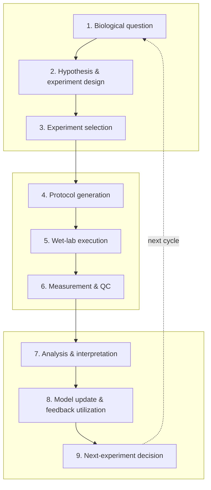

**English** | [简体中文](README_zh.md)

# Awesome Autonomous Biology

> A biology-specific, closed-loop, evidence-graded atlas of autonomous biology.

    

**In one sentence:** an auditable map of resources that support one or more stages of a closed biological discovery loop.

- **What this is:** a focused index of autonomous biology systems, scientific decision modules, infrastructure, data/evaluation resources, and ecosystem entry points.
- **What this is not:** a generic AI-agent, laboratory-automation, or robotics list—and not a claim that AI or robotic control equals end-to-end scientific autonomy.

> [!IMPORTANT]
> **Automation ≠ scientific autonomy; inclusion ≠ endorsement.** Scientific and operational autonomy are scored separately. Inclusion neither endorses a capability claim nor relicenses any third-party resource.

## The nine-stage dry–wet loop

The loop is an information model. A resource need not cover every stage, and the atlas never implies undeclared coverage.

## Taxonomy

Primary categories answer “what is it?” Multidimensional tags describe what it does: loop stage, resource type, biology domain, openness, evidence grade, and separate scientific/operational autonomy.

| # | Primary category | 中文 | Seeds |
|---:|---|---|---:|
| 1 | Surveys & Perspectives | 综述、观点与路线图 | 2 |
| 2 | End-to-End Autonomous Biology Systems | 端到端自主生物学系统 | 4 |
| 3 | Scientific Agents for Biology | 生物学科学智能体 | 3 |
| 4 | Biological Experiment Design | 生物实验设计 | 2 |
| 5 | Perturbation & Virtual Cell | 扰动建模与虚拟细胞 | 2 |
| 6 | Protein & Sequence Engineering | 蛋白与序列工程 | 3 |
| 7 | Drug Discovery & Cell-Based Screening | 药物发现与细胞筛选 | 2 |
| 8 | Synthetic Biology & Biofoundries | 合成生物学与生物铸造厂 | 2 |
| 9 | Protocol Generation & Representation | 实验协议生成与表示 | 2 |
| 10 | Laboratory Orchestration & LabOS | 实验室编排与 LabOS | 3 |
| 11 | Robotic & Instrument Control | 机器人与仪器控制 | 2 |
| 12 | Measurement, QC & Data Analysis | 测量、质控与数据分析 | 2 |
| 13 | Feedback Learning & Model Updating | 反馈学习与模型更新 | 2 |
| 14 | Data Standards & Provenance | 数据标准与溯源 | 2 |
| 15 | Simulators & Digital Twins | 模拟器与数字孪生 | 2 |
| 16 | Benchmarks & Evaluation | 基准与评测 | 3 |
| 17 | Datasets from Closed-Loop Experiments | 闭环实验数据集 | 2 |
| 18 | Agent Skills, MCP & Tool Adapters | Agent 技能、MCP 与工具适配器 | 2 |
| 19 | Open Hardware | 开放硬件 | 3 |
| 20 | Cloud Labs & Commercial Platforms | 云实验室与商业平台 | 3 |
| 21 | Tutorials, Courses & Communities | 教程、课程与社区 | 2 |

## Gold Seed v0.1

The dataset is generated from one YAML fact source: **50 curated seed records: 47 currently verified and 3 review-pending after link audit; 21 primary categories and 5 resource classes**. Latest verification: **2026-07-18**.

## Awesome list

### Surveys & Perspectives

- **[Perspectives for self-driving labs in synthetic biology](https://www.sciencedirect.com/science/article/pii/S0958166922002154)** — A biology-specific perspective on how self-driving laboratories could reshape synthetic-biology design–build–test–learn cycles.  
  Year 2023 · Evidence A · Scientific autonomy not_applicable · Operational autonomy not_applicable · [Paper](https://doi.org/10.1016/j.copbio.2022.102881)
- **[Autonomous ‘self-driving’ laboratories: a review of technology and policy implications](https://pubmed.ncbi.nlm.nih.gov/40852582/)** — A recent review that separates self-driving-lab technologies from their governance, policy, and societal implications.  
  Year 2025 · Evidence A · Scientific autonomy not_applicable · Operational autonomy not_applicable · [Paper](https://doi.org/10.1098/rsos.250646)

### End-to-End Autonomous Biology Systems

- **[Robot Scientist Adam / The Automation of Science](https://www.science.org/doi/10.1126/science.1165620)** — A landmark robot scientist that generated and tested functional-genomics hypotheses in yeast.  
  Year 2009 · Evidence B · Scientific autonomy high · Operational autonomy high · [Paper](https://doi.org/10.1126/science.1165620)
- **[BacterAI](https://www.nature.com/articles/s41564-023-01376-0)** — An automated platform that turns microbial-metabolism questions into robot-executed experiments and iteratively learns interpretable rules.  
  Year 2023 · Evidence A · Scientific autonomy high · Operational autonomy high · [Paper](https://doi.org/10.1038/s41564-023-01376-0) · [Code](https://github.com/jensenlab/BacterAI) · [Data](https://github.com/jensenlab/BacterAI/tree/master/published_data)
- **[Generalized AI-powered autonomous enzyme engineering platform](https://www.nature.com/articles/s41467-025-61209-y)** — A generalized autonomous enzyme-engineering workflow linking AI-guided design, worklist generation, robotic execution, assays, and iterative learning.  
  Year 2025 · Evidence A · Scientific autonomy high · Operational autonomy high · [Paper](https://doi.org/10.1038/s41467-025-61209-y) · [Code](https://github.com/Zhao-Group/Primer_Design_and_Worklists) · [Data](https://zenodo.org/records/15243671) · [Official](https://ibiofoundry.illinois.edu/)
- **[LUMI-lab](https://www.cell.com/cell/abstract/S0092-8674%2826%2900099-1)** — A foundation-model-driven autonomous laboratory for iterative discovery of ionizable lipids for mRNA delivery.  
  Year 2026 · Evidence A · Scientific autonomy high · Operational autonomy high · [Paper](https://doi.org/10.1016/j.cell.2026.01.012) · [Code](https://github.com/bowenli-lab/LUMI-lab) · [Data](https://github.com/bowenli-lab/LUMI-lab/tree/main/mapping_table)

### Scientific Agents for Biology

- **[BioDiscoveryAgent](https://arxiv.org/abs/2405.17631)** — A tool-using LLM agent for proposing, executing computational analyses, and refining biological discovery workflows.  
  Year 2024 · Evidence B · Scientific autonomy partial · Operational autonomy none · [Paper](https://arxiv.org/abs/2405.17631) · [Code](https://github.com/snap-stanford/BioDiscoveryAgent)
- **[Robin](https://www.nature.com/articles/s41586-026-10652-y)** — A multi-agent system that automates literature research, hypothesis generation, and computational analysis across a scientific-discovery campaign.  
  Year 2026 · Evidence A · Scientific autonomy partial · Operational autonomy none · [Paper](https://doi.org/10.1038/s41586-026-10652-y) · [Code](https://github.com/Future-House/robin) · [Official](https://www.futurehouse.org/research/demonstrating-end-to-end-scientific-discovery-with-robin-a-multi-agent-system)
- **[Biomni](https://biomni.stanford.edu/)** — A general-purpose biomedical agent environment that plans analyses and calls a broad collection of biological tools and databases.  
  Year 2025 · Evidence B · Scientific autonomy assisted · Operational autonomy none · [Paper](https://www.biorxiv.org/content/10.1101/2025.05.30.656746v1) · [Code](https://github.com/snap-stanford/biomni) · [Official](https://biomni.stanford.edu/)

### Biological Experiment Design

- **[LaMBO](https://arxiv.org/abs/2203.12742)** — A latent-space Bayesian-optimization method for multi-objective biological sequence design.  
  Year 2022 · Evidence B · Scientific autonomy partial · Operational autonomy none · [Paper](https://arxiv.org/abs/2203.12742) · [Code](https://github.com/samuelstanton/lambo)
- **[BRADSHAW](https://pmc.ncbi.nlm.nih.gov/articles/PMC7292824/)** — A closed-loop Bayesian optimization framework for designing informative experiments under small-data constraints.  
  Year 2019 · Evidence B · Scientific autonomy partial · Operational autonomy none · [Paper](https://doi.org/10.1007/s10822-019-00234-8)

### Perturbation & Virtual Cell

- **[GEARS](https://www.nature.com/articles/s41587-023-01905-6)** — A graph-based model for predicting transcriptional responses to unseen genetic perturbations.  
  Year 2023 · Evidence A · Scientific autonomy partial · Operational autonomy none · [Paper](https://doi.org/10.1038/s41587-023-01905-6) · [Code](https://github.com/snap-stanford/GEARS)
- **[Compositional Perturbation Autoencoder (CPA)](https://link.springer.com/article/10.15252/msb.202211517)** — A compositional model for predicting single-cell responses to unseen combinations of perturbations, doses, and covariates.  
  Year 2023 · Evidence A · Scientific autonomy partial · Operational autonomy none · [Paper](https://doi.org/10.15252/msb.202211517) · [Code](https://github.com/theislab/CPA)

### Protein & Sequence Engineering

- **[EVOLVEpro](https://www.science.org/doi/10.1126/science.adr6006)** — A protein-engineering framework that combines sequence models with iterative experimental feedback to prioritize variants.  
  Year 2025 · Evidence A · Scientific autonomy partial · Operational autonomy assisted · [Paper](https://doi.org/10.1126/science.adr6006) · [Code](https://github.com/mat10d/EvolvePro)
- **[Low-N protein engineering](https://pubmed.ncbi.nlm.nih.gov/33828272/)** — A practical small-data machine-learning workflow for prioritizing protein variants with limited measurements.  
  Year 2021 · Evidence A · Scientific autonomy partial · Operational autonomy assisted · [Paper](https://doi.org/10.1038/s41592-021-01100-y) · [Code](https://github.com/churchlab/low-N-protein-engineering)
- **[Machine-learning-assisted directed protein evolution (MLDE)](https://www.pnas.org/doi/10.1073/pnas.1901979116)** — A machine-learning-guided strategy for selecting compact, informative variant libraries for directed evolution.  
  Year 2019 · Evidence A · Scientific autonomy partial · Operational autonomy assisted · [Paper](https://doi.org/10.1073/pnas.1901979116) · [Code](https://github.com/fhalab/MLDE)

### Drug Discovery & Cell-Based Screening

- **[Robot Scientist Eve](https://royalsocietypublishing.org/rsif/article/12/104/20141289/35592/Cheaper-faster-drug-development-validated-by-the)** — A robot scientist that automated phenotypic screening and identified candidate compounds for neglected-disease drug discovery.  
  Year 2015 · Evidence B · Scientific autonomy high · Operational autonomy high · [Paper](https://doi.org/10.1098/rsif.2014.1289)
- **[Quadratic Phenotypic Optimization Platform (QPOP)](https://www.science.org/doi/10.1126/scitranslmed.aan0941)** — A phenotype-driven platform for efficiently searching and optimizing multidrug combinations.  
  Year 2018 · Evidence B · Scientific autonomy partial · Operational autonomy assisted · [Paper](https://doi.org/10.1126/scitranslmed.aan0941)

### Synthetic Biology & Biofoundries

- **[NSF iBioFoundry (iBioFAB)](https://ibiofoundry.illinois.edu/)** — A highly automated synthetic-biology biofoundry that provides infrastructure for design–build–test–learn workflows.  
  Year date not asserted · Evidence B · Scientific autonomy none · Operational autonomy high · [Official](https://ibiofoundry.illinois.edu/)

### Protocol Generation & Representation

- **[Autoprotocol](https://autoprotocol.org/)** — A machine-readable protocol specification and software ecosystem for describing executable laboratory procedures.  
  Year date not asserted · Evidence A · Scientific autonomy not_applicable · Operational autonomy partial · [Code](https://github.com/autoprotocol/autoprotocol-python) · [Official](https://autoprotocol.org/)
- **[LabOP](https://bioprotocols.github.io/)** — An ontology-based language for representing, exchanging, and compiling laboratory protocols across execution environments.  
  Year 2023 · Evidence A · Scientific autonomy not_applicable · Operational autonomy partial · [Paper](https://doi.org/10.1145/3604568) · [Code](https://github.com/Bioprotocols/labop) · [Official](https://bioprotocols.github.io/)

### Laboratory Orchestration & LabOS

- **[Aquarium](https://academic.oup.com/synbio/article/6/1/ysab006/6124325)** — A laboratory operating system for planning, executing, tracking, and reproducing complex biological workflows.  
  Year 2021 · Evidence A · Scientific autonomy none · Operational autonomy partial · [Paper](https://doi.org/10.1093/synbio/ysab006) · [Code](https://github.com/aquariumbio/aquarium)
- **[HELAO](https://github.com/helgestein/helao-pub)** — A modular orchestration framework for coordinating instrument servers and automated laboratory experiments.  
  Year date not asserted · Evidence B · Scientific autonomy none · Operational autonomy high · [Code](https://github.com/helgestein/helao-pub) · [Official](https://fuzhanrahmanian.com/project/helao/)
- **[MADSci](https://joss.theoj.org/papers/10.21105/joss.09416)** — A modular framework for scheduling workflows and coordinating devices, resources, and data in autonomous laboratories.  
  Year 2026 · Evidence A · Scientific autonomy none · Operational autonomy high · [Paper](https://doi.org/10.21105/joss.09416) · [Code](https://github.com/AD-SDL/MADSci)

### Robotic & Instrument Control

- **[PyLabRobot](https://docs.pylabrobot.org/)** — A hardware-agnostic Python framework for controlling liquid handlers and other laboratory devices.  
  Year 2023 · Evidence A · Scientific autonomy none · Operational autonomy partial · [Paper](https://doi.org/10.1016/j.device.2023.100111) · [Code](https://github.com/PyLabRobot/pylabrobot) · [Official](https://docs.pylabrobot.org/)
- **[SiLA 2](https://sila-standard.com/)** — A standard and software base for interoperable communication with laboratory instruments.  
  Year date not asserted · Evidence A · Scientific autonomy not_applicable · Operational autonomy partial · [Code](https://gitlab.com/SiLA2/sila_base) · [Official](https://sila2.gitlab.io/)

### Measurement, QC & Data Analysis

- **[CellProfiler](https://cellprofiler.org/)** — A widely used open platform for reproducible, high-throughput quantitative analysis of biological images.  
  Year 2018 · Evidence A · Scientific autonomy none · Operational autonomy partial · [Paper](https://doi.org/10.1371/journal.pbio.2005970) · [Code](https://github.com/CellProfiler/CellProfiler) · [Official](https://cellprofiler.org/)

### Feedback Learning & Model Updating

- **[Automated Recommendation Tool (ART)](https://www.nature.com/articles/s41467-020-18008-4)** — A Bayesian ensemble framework that learns from biological experiments and recommends new designs under uncertainty.  
  Year 2020 · Evidence B · Scientific autonomy partial · Operational autonomy assisted · [Paper](https://doi.org/10.1038/s41467-020-18008-4) · [Code](https://github.com/JBEI/ART)
- **[Active Learning-assisted Directed Evolution (ALDE)](https://www.nature.com/articles/s41467-025-55987-8)** — An iterative active-learning workflow that updates sequence–fitness models across rounds of directed-evolution experiments.  
  Year 2025 · Evidence A · Scientific autonomy partial · Operational autonomy assisted · [Paper](https://doi.org/10.1038/s41467-025-55987-8) · [Code](https://github.com/jsunn-y/ALDE)

### Data Standards & Provenance

- **[ISA-Tab and ISA tools](https://isa-tools.org/)** — A standards and tooling ecosystem for structuring investigation, study, assay, and provenance metadata in life science.  
  Year date not asserted · Evidence A · Scientific autonomy not_applicable · Operational autonomy not_applicable · [Paper](https://pmc.ncbi.nlm.nih.gov/articles/PMC8444265/) · [Code](https://github.com/ISA-tools) · [Official](https://isa-tools.org/)

### Simulators & Digital Twins

- **[Vivarium](https://academic.oup.com/bioinformatics/article/38/7/1972/6522109)** — A framework for composing heterogeneous biological models into multiscale simulations.  
  Year 2022 · Evidence A · Scientific autonomy not_applicable · Operational autonomy not_applicable · [Paper](https://doi.org/10.1093/bioinformatics/btac049) · [Code](https://github.com/vivarium-collective/vivarium-core)
- **[BioSimulators](https://biosimulators.org/)** — A registry and standardized execution ecosystem for reproducible simulation of biological models.  
  Year 2022 · Evidence A · Scientific autonomy not_applicable · Operational autonomy not_applicable · [Paper](https://doi.org/10.1093/nar/gkac331) · [Code](https://github.com/biosimulators) · [Official](https://biosimulators.org/)

### Benchmarks & Evaluation

- **[LABBench2](https://arxiv.org/abs/2604.09554)** — A benchmark suite for evaluating AI systems on nearly 1,900 biology-research tasks across reasoning and laboratory-relevant skills.  
  Year 2026 · Evidence B · Scientific autonomy not_applicable · Operational autonomy not_applicable · [Paper](https://arxiv.org/abs/2604.09554) · [Code](https://github.com/EdisonScientific/labbench2) · [Data](https://huggingface.co/datasets/EdisonScientific/labbench2)
- **[Virtual Cell Challenge](https://virtualcellchallenge.org/)** — A community challenge and dataset ecosystem for evaluating models that predict cellular responses to perturbations.  
  Year 2025 · Evidence B · Scientific autonomy not_applicable · Operational autonomy not_applicable · [Paper](https://www.cell.com/cell/fulltext/S0092-8674%2825%2900675-0) · [Data](https://virtualcellchallenge.org/datasets) · [Official](https://virtualcellchallenge.org/)
- **[ProteinGym](https://proteingym.org/)** — A large evaluation suite for protein-sequence models using experimentally measured fitness landscapes.  
  Year 2023 · Evidence A · Scientific autonomy not_applicable · Operational autonomy not_applicable · [Paper](https://pubmed.ncbi.nlm.nih.gov/38106144/) · [Code](https://github.com/OATML-Markslab/ProteinGym) · [Data](https://proteingym.org/) · [Official](https://proteingym.org/)

### Datasets from Closed-Loop Experiments

- **[BacterAI autonomous-experiment dataset](https://github.com/jensenlab/BacterAI/tree/master/published_data)** — Published data from BacterAI’s iterative microbial-metabolism experiments, suitable for studying active-learning trajectories.  
  Year 2023 · Evidence A · Scientific autonomy not_applicable · Operational autonomy not_applicable · [Paper](https://doi.org/10.1038/s41564-023-01376-0) · [Data](https://github.com/jensenlab/BacterAI/tree/master/published_data)
- **[LUMI-lab iterative LNP design data](https://github.com/bowenli-lab/LUMI-lab/tree/main/mapping_table)** — Data and mapping tables from iterative ionizable-lipid design and testing in LUMI-lab.  
  Year 2026 · Evidence A · Scientific autonomy not_applicable · Operational autonomy not_applicable · [Paper](https://doi.org/10.1016/j.cell.2026.01.012) · [Data](https://github.com/bowenli-lab/LUMI-lab/tree/main/mapping_table)

### Agent Skills, MCP & Tool Adapters

- **[ToolUniverse](https://zitniklab.hms.harvard.edu/ToolUniverse/)** — A large scientific tool ecosystem that exposes more than a thousand research resources for agentic workflows.  
  Year 2025 · Evidence B · Scientific autonomy assisted · Operational autonomy none · [Paper](https://arxiv.org/abs/2509.23426) · [Code](https://github.com/mims-harvard/ToolUniverse) · [Official](https://zitniklab.hms.harvard.edu/ToolUniverse/)
- **[BioMCP](https://biomcp.org/)** — An MCP and command-line interface that gives agents structured access to trusted biomedical sources.  
  Year date not asserted · Evidence A · Scientific autonomy not_applicable · Operational autonomy assisted · [Code](https://github.com/genomoncology/biomcp) · [Official](https://biomcp.org/)

### Open Hardware

- **[Chi.Bio](https://chi.bio/)** — An open-source, networked bioreactor platform for automated continuous-culture experiments.  
  Year 2020 · Evidence A · Scientific autonomy none · Operational autonomy high · [Paper](https://doi.org/10.1371/journal.pbio.3000794) · [Code](https://github.com/HarrisonSteel/ChiBio) · [Official](https://chi.bio/)
- **[OpenFlexure Microscope](https://openflexure.org/)** — An open, motorized microscope platform that can serve as an imaging and measurement endpoint in automated biology workflows.  
  Year 2020 · Evidence A · Scientific autonomy none · Operational autonomy partial · [Paper](https://pmc.ncbi.nlm.nih.gov/articles/PMC7249832/) · [Code](https://github.com/rwb27/openflexure_microscope) · [Official](https://openflexure.org/)
- **[Opentrons OT-2](https://github.com/Opentrons/ot2)** — A programmable liquid-handling robot with official hardware files and an open software stack used across biological automation.  
  Year date not asserted · Evidence A · Scientific autonomy none · Operational autonomy high · [Code](https://github.com/Opentrons/opentrons) · [Official](https://opentrons.com/)

### Cloud Labs & Commercial Platforms

- **[Emerald Cloud Lab](https://www.emeraldcloudlab.com/)** — A commercial remote laboratory where users specify and run experiments through a cloud software interface.  
  Year date not asserted · Evidence C · Scientific autonomy assisted · Operational autonomy high · [Official](https://www.emeraldcloudlab.com/how-it-works/run/)
- **[Culture Biosciences](https://www.culturebiosciences.com/)** — A commercial cloud-connected bioreactor platform for remote bioprocess development and data collection.  
  Year date not asserted · Evidence C · Scientific autonomy none · Operational autonomy high · [Official](https://www.culturebiosciences.com/)
- **[Arctoris Ulysses](https://www.arctoris.com/)** — A commercial robotic drug-discovery laboratory platform centered on its Ulysses automation stack.  
  Year date not asserted · Evidence C · Scientific autonomy assisted · Operational autonomy high · [Official](https://www.arctoris.com/about-us/)

### Tutorials, Courses & Communities

- **[Global Biofoundries Alliance](https://www.biofoundries.org/)** — An international alliance connecting biofoundries and promoting shared capabilities, standards, and collaboration.  
  Year date not asserted · Evidence C · Scientific autonomy not_applicable · Operational autonomy not_applicable · [Official](https://www.biofoundries.org/about)
- **[Lab Automation Forums](https://labautomation.io/)** — A practitioner community for laboratory automation, integration, troubleshooting, and shared implementation knowledge.  
  Year date not asserted · Evidence C · Scientific autonomy not_applicable · Operational autonomy not_applicable · [Official](https://labautomation.io/t/welcome-to-lab-automation-forums/7)

## Explore and maintain

- **Website:** available at the project Pages URL after GitHub Pages is enabled; run `pnpm dev` locally.
- **How to explore:** Atlas offers URL-shareable filters; Loop Map navigates the nine stages; Timeline, Ecosystem, Radar, and Digest provide complementary views.
- **Data schema:** [strict JSON Schema](schemas/resource.schema.json); fact source: [Gold Seed YAML](data/gold-seed-v0.1.yml); link-audit state: [review flags](data/review-flags.yml).
- **Update pipeline:** automated discovery creates only `review_pending` candidates; only a human-reviewed PR can enter the verified Atlas.
- **Contributing:** see [CONTRIBUTING.md](CONTRIBUTING.md) and [CURATION.md](CURATION.md).
- **Citation:** see [CITATION.cff](CITATION.cff).
- **License:** original code is [MIT](LICENSE); original curation metadata and bilingual summaries are [CC BY 4.0](LICENSE-DATA). Third-party papers, code, data, standards, hardware, and trademarks remain under their original rights.

## Before publishing

Replace the GitHub owner placeholder in [`config/project.yml`](config/project.yml) with your account or organization. Local builds safely fall back while it remains unchanged.

---

Data and this README are deterministically generated. Do not hand-edit the list; run `pnpm generate`.
