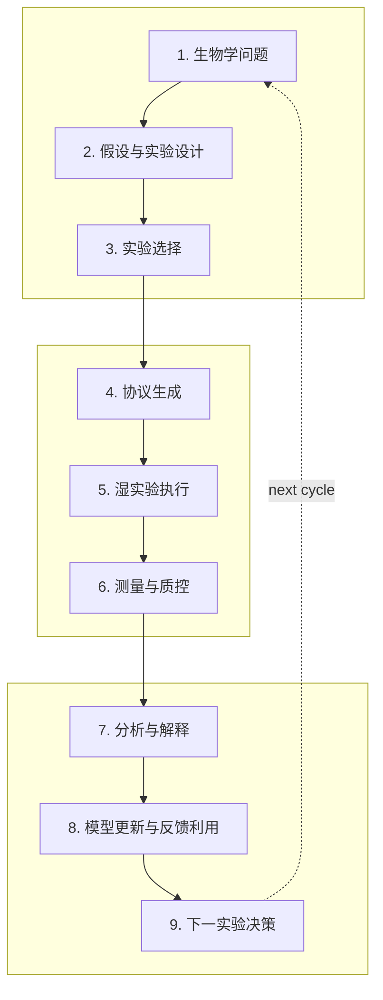

[English](README.md) | **简体中文**

# Awesome Autonomous Biology

> 面向生物学发现闭环的、按证据分级的自主生物学资源图谱。

    

**一句话定义：** 这是一个 biology-specific、closed-loop、evidence-graded 的可审计资源目录。

- **它是什么：** 帮助研究者定位自主生物学系统、科学决策模块、基础设施、数据/评测资源和生态教育入口。
- **它不是什么：** 泛 AI Agent、泛实验室自动化或泛机器人清单，也不把“用了 AI/机器人”当作端到端科学自治。

> [!IMPORTANT]
> **automation ≠ scientific autonomy；inclusion ≠ endorsement。** 科学自治和操作自治分别标注。收录不代表项目能力背书，也不重新授权任何第三方资源。

## 九阶段干湿闭环

九阶段是信息组织模型；单个资源不必、也不会被视觉暗示为覆盖全部阶段。

## 分类法

一级目录回答“它是什么”；闭环阶段、资源类型、生物领域、开放程度、证据等级及双自治评分回答“它做什么”。

| # | 一级目录 | 英文名称 | 种子数 |
|---:|---|---|---:|
| 1 | 综述、观点与路线图 | Surveys & Perspectives | 2 |
| 2 | 端到端自主生物学系统 | End-to-End Autonomous Biology Systems | 4 |
| 3 | 生物学科学智能体 | Scientific Agents for Biology | 3 |
| 4 | 生物实验设计 | Biological Experiment Design | 2 |
| 5 | 扰动建模与虚拟细胞 | Perturbation & Virtual Cell | 2 |
| 6 | 蛋白与序列工程 | Protein & Sequence Engineering | 3 |
| 7 | 药物发现与细胞筛选 | Drug Discovery & Cell-Based Screening | 2 |
| 8 | 合成生物学与生物铸造厂 | Synthetic Biology & Biofoundries | 2 |
| 9 | 实验协议生成与表示 | Protocol Generation & Representation | 2 |
| 10 | 实验室编排与 LabOS | Laboratory Orchestration & LabOS | 3 |
| 11 | 机器人与仪器控制 | Robotic & Instrument Control | 2 |
| 12 | 测量、质控与数据分析 | Measurement, QC & Data Analysis | 2 |
| 13 | 反馈学习与模型更新 | Feedback Learning & Model Updating | 2 |
| 14 | 数据标准与溯源 | Data Standards & Provenance | 2 |
| 15 | 模拟器与数字孪生 | Simulators & Digital Twins | 2 |
| 16 | 基准与评测 | Benchmarks & Evaluation | 3 |
| 17 | 闭环实验数据集 | Datasets from Closed-Loop Experiments | 2 |
| 18 | Agent 技能、MCP 与工具适配器 | Agent Skills, MCP & Tool Adapters | 2 |
| 19 | 开放硬件 | Open Hardware | 3 |
| 20 | 云实验室与商业平台 | Cloud Labs & Commercial Platforms | 3 |
| 21 | 教程、课程与社区 | Tutorials, Courses & Communities | 2 |

## Gold Seed v0.1

当前数据集由同一 YAML 事实源生成：**50 条策展种子记录，其中 47 条当前 verified、3 条因链接审计 review_pending；共 21 个一级目录、5 种 resource class**。最近核验日期为 **2026-07-18**。

## Awesome 清单

### 综述、观点与路线图

- **[Perspectives for self-driving labs in synthetic biology](https://www.sciencedirect.com/science/article/pii/S0958166922002154)** — 从合成生物学视角讨论自驱动实验室如何重塑 Design–Build–Test–Learn 闭环。  
  年份 2023 · 证据 A · 科学自治 not_applicable · 操作自治 not_applicable · [Paper](https://doi.org/10.1016/j.copbio.2022.102881)
- **[Autonomous ‘self-driving’ laboratories: a review of technology and policy implications](https://pubmed.ncbi.nlm.nih.gov/40852582/)** — 系统梳理自驱动实验室技术，并将工程能力与治理、政策和社会影响区分开来。  
  年份 2025 · 证据 A · 科学自治 not_applicable · 操作自治 not_applicable · [Paper](https://doi.org/10.1098/rsos.250646)

### 端到端自主生物学系统

- **[Robot Scientist Adam / The Automation of Science](https://www.science.org/doi/10.1126/science.1165620)** — 机器人科学家早期里程碑，可在酵母功能基因组学中提出并检验假设。  
  年份 2009 · 证据 B · 科学自治 high · 操作自治 high · [Paper](https://doi.org/10.1126/science.1165620)
- **[BacterAI](https://www.nature.com/articles/s41564-023-01376-0)** — 将微生物代谢问题转化为机器人实验，并通过迭代学习得到可解释规则的自动化平台。  
  年份 2023 · 证据 A · 科学自治 high · 操作自治 high · [Paper](https://doi.org/10.1038/s41564-023-01376-0) · [Code](https://github.com/jensenlab/BacterAI) · [Data](https://github.com/jensenlab/BacterAI/tree/master/published_data)
- **[Generalized AI-powered autonomous enzyme engineering platform](https://www.nature.com/articles/s41467-025-61209-y)** — 连接 AI 设计、工作列表生成、机器人执行、检测与迭代学习的通用自主酶工程流程。  
  年份 2025 · 证据 A · 科学自治 high · 操作自治 high · [Paper](https://doi.org/10.1038/s41467-025-61209-y) · [Code](https://github.com/Zhao-Group/Primer_Design_and_Worklists) · [Data](https://zenodo.org/records/15243671) · [Official](https://ibiofoundry.illinois.edu/)
- **[LUMI-lab](https://www.cell.com/cell/abstract/S0092-8674%2826%2900099-1)** — 面向 mRNA 递送用可离子化脂质迭代发现的基础模型驱动自主实验室。  
  年份 2026 · 证据 A · 科学自治 high · 操作自治 high · [Paper](https://doi.org/10.1016/j.cell.2026.01.012) · [Code](https://github.com/bowenli-lab/LUMI-lab) · [Data](https://github.com/bowenli-lab/LUMI-lab/tree/main/mapping_table)

### 生物学科学智能体

- **[BioDiscoveryAgent](https://arxiv.org/abs/2405.17631)** — 可调用工具来提出、执行计算分析并迭代生物学发现流程的 LLM Agent。  
  年份 2024 · 证据 B · 科学自治 partial · 操作自治 none · [Paper](https://arxiv.org/abs/2405.17631) · [Code](https://github.com/snap-stanford/BioDiscoveryAgent)
- **[Robin](https://www.nature.com/articles/s41586-026-10652-y)** — 在完整发现任务中自动完成文献研究、假设生成与计算分析的多智能体系统。  
  年份 2026 · 证据 A · 科学自治 partial · 操作自治 none · [Paper](https://doi.org/10.1038/s41586-026-10652-y) · [Code](https://github.com/Future-House/robin) · [Official](https://www.futurehouse.org/research/demonstrating-end-to-end-scientific-discovery-with-robin-a-multi-agent-system)
- **[Biomni](https://biomni.stanford.edu/)** — 可规划分析并调用大量生物工具与数据库的通用生物医学 Agent 环境。  
  年份 2025 · 证据 B · 科学自治 assisted · 操作自治 none · [Paper](https://www.biorxiv.org/content/10.1101/2025.05.30.656746v1) · [Code](https://github.com/snap-stanford/biomni) · [Official](https://biomni.stanford.edu/)

### 生物实验设计

- **[LaMBO](https://arxiv.org/abs/2203.12742)** — 用于多目标生物序列设计的潜空间贝叶斯优化方法。  
  年份 2022 · 证据 B · 科学自治 partial · 操作自治 none · [Paper](https://arxiv.org/abs/2203.12742) · [Code](https://github.com/samuelstanton/lambo)
- **[BRADSHAW](https://pmc.ncbi.nlm.nih.gov/articles/PMC7292824/)** — 面向小数据条件下信息增益实验选择的闭环贝叶斯优化框架。  
  年份 2019 · 证据 B · 科学自治 partial · 操作自治 none · [Paper](https://doi.org/10.1007/s10822-019-00234-8)

### 扰动建模与虚拟细胞

- **[GEARS](https://www.nature.com/articles/s41587-023-01905-6)** — 用于预测未见遗传扰动转录响应的图模型。  
  年份 2023 · 证据 A · 科学自治 partial · 操作自治 none · [Paper](https://doi.org/10.1038/s41587-023-01905-6) · [Code](https://github.com/snap-stanford/GEARS)
- **[Compositional Perturbation Autoencoder (CPA)](https://link.springer.com/article/10.15252/msb.202211517)** — 预测细胞对未见扰动组合、剂量与协变量响应的组合式单细胞模型。  
  年份 2023 · 证据 A · 科学自治 partial · 操作自治 none · [Paper](https://doi.org/10.15252/msb.202211517) · [Code](https://github.com/theislab/CPA)

### 蛋白与序列工程

- **[EVOLVEpro](https://www.science.org/doi/10.1126/science.adr6006)** — 结合序列模型与多轮实验反馈来优选变体的蛋白工程框架。  
  年份 2025 · 证据 A · 科学自治 partial · 操作自治 assisted · [Paper](https://doi.org/10.1126/science.adr6006) · [Code](https://github.com/mat10d/EvolvePro)
- **[Low-N protein engineering](https://pubmed.ncbi.nlm.nih.gov/33828272/)** — 在测量数据有限时优选蛋白变体的实用小数据机器学习流程。  
  年份 2021 · 证据 A · 科学自治 partial · 操作自治 assisted · [Paper](https://doi.org/10.1038/s41592-021-01100-y) · [Code](https://github.com/churchlab/low-N-protein-engineering)
- **[Machine-learning-assisted directed protein evolution (MLDE)](https://www.pnas.org/doi/10.1073/pnas.1901979116)** — 以机器学习指导构建紧凑且高信息量变体库的定向进化策略。  
  年份 2019 · 证据 A · 科学自治 partial · 操作自治 assisted · [Paper](https://doi.org/10.1073/pnas.1901979116) · [Code](https://github.com/fhalab/MLDE)

### 药物发现与细胞筛选

- **[Robot Scientist Eve](https://royalsocietypublishing.org/rsif/article/12/104/20141289/35592/Cheaper-faster-drug-development-validated-by-the)** — 自动开展表型筛选并为被忽视疾病发现候选化合物的机器人科学家。  
  年份 2015 · 证据 B · 科学自治 high · 操作自治 high · [Paper](https://doi.org/10.1098/rsif.2014.1289)
- **[Quadratic Phenotypic Optimization Platform (QPOP)](https://www.science.org/doi/10.1126/scitranslmed.aan0941)** — 以表型数据驱动高效搜索和优化多药组合的平台。  
  年份 2018 · 证据 B · 科学自治 partial · 操作自治 assisted · [Paper](https://doi.org/10.1126/scitranslmed.aan0941)

### 合成生物学与生物铸造厂

- **[NSF iBioFoundry (iBioFAB)](https://ibiofoundry.illinois.edu/)** — 为合成生物学 Design–Build–Test–Learn 提供高自动化基础设施的生物铸造厂。  
  年份 日期未断言 · 证据 B · 科学自治 none · 操作自治 high · [Official](https://ibiofoundry.illinois.edu/)

### 实验协议生成与表示

- **[Autoprotocol](https://autoprotocol.org/)** — 用于描述可执行实验步骤的机器可读协议规范与软件生态。  
  年份 日期未断言 · 证据 A · 科学自治 not_applicable · 操作自治 partial · [Code](https://github.com/autoprotocol/autoprotocol-python) · [Official](https://autoprotocol.org/)
- **[LabOP](https://bioprotocols.github.io/)** — 用于跨执行环境表示、交换和编译实验协议的本体语言。  
  年份 2023 · 证据 A · 科学自治 not_applicable · 操作自治 partial · [Paper](https://doi.org/10.1145/3604568) · [Code](https://github.com/Bioprotocols/labop) · [Official](https://bioprotocols.github.io/)

### 实验室编排与 LabOS

- **[Aquarium](https://academic.oup.com/synbio/article/6/1/ysab006/6124325)** — 用于规划、执行、追踪和复现实验室复杂生物工作流的 LabOS。  
  年份 2021 · 证据 A · 科学自治 none · 操作自治 partial · [Paper](https://doi.org/10.1093/synbio/ysab006) · [Code](https://github.com/aquariumbio/aquarium)
- **[HELAO](https://github.com/helgestein/helao-pub)** — 用于协调仪器服务与自动化实验的模块化实验室编排框架。  
  年份 日期未断言 · 证据 B · 科学自治 none · 操作自治 high · [Code](https://github.com/helgestein/helao-pub) · [Official](https://fuzhanrahmanian.com/project/helao/)
- **[MADSci](https://joss.theoj.org/papers/10.21105/joss.09416)** — 在自主实验室中调度工作流并协调设备、资源和数据的模块化框架。  
  年份 2026 · 证据 A · 科学自治 none · 操作自治 high · [Paper](https://doi.org/10.21105/joss.09416) · [Code](https://github.com/AD-SDL/MADSci)

### 机器人与仪器控制

- **[PyLabRobot](https://docs.pylabrobot.org/)** — 面向移液工作站及其他实验设备的硬件无关 Python 控制框架。  
  年份 2023 · 证据 A · 科学自治 none · 操作自治 partial · [Paper](https://doi.org/10.1016/j.device.2023.100111) · [Code](https://github.com/PyLabRobot/pylabrobot) · [Official](https://docs.pylabrobot.org/)
- **[SiLA 2](https://sila-standard.com/)** — 用于实验仪器互操作通信的标准与软件基础。  
  年份 日期未断言 · 证据 A · 科学自治 not_applicable · 操作自治 partial · [Code](https://gitlab.com/SiLA2/sila_base) · [Official](https://sila2.gitlab.io/)

### 测量、质控与数据分析

- **[CellProfiler](https://cellprofiler.org/)** — 广泛使用的开源生物图像高通量定量分析平台，强调可复现流程。  
  年份 2018 · 证据 A · 科学自治 none · 操作自治 partial · [Paper](https://doi.org/10.1371/journal.pbio.2005970) · [Code](https://github.com/CellProfiler/CellProfiler) · [Official](https://cellprofiler.org/)

### 反馈学习与模型更新

- **[Automated Recommendation Tool (ART)](https://www.nature.com/articles/s41467-020-18008-4)** — 从生物实验中学习并在不确定性下推荐新设计的贝叶斯集成框架。  
  年份 2020 · 证据 B · 科学自治 partial · 操作自治 assisted · [Paper](https://doi.org/10.1038/s41467-020-18008-4) · [Code](https://github.com/JBEI/ART)
- **[Active Learning-assisted Directed Evolution (ALDE)](https://www.nature.com/articles/s41467-025-55987-8)** — 在多轮定向进化实验中持续更新序列—适应度模型的主动学习流程。  
  年份 2025 · 证据 A · 科学自治 partial · 操作自治 assisted · [Paper](https://doi.org/10.1038/s41467-025-55987-8) · [Code](https://github.com/jsunn-y/ALDE)

### 数据标准与溯源

- **[ISA-Tab and ISA tools](https://isa-tools.org/)** — 用于组织生命科学 Investigation、Study、Assay 与溯源元数据的标准和工具生态。  
  年份 日期未断言 · 证据 A · 科学自治 not_applicable · 操作自治 not_applicable · [Paper](https://pmc.ncbi.nlm.nih.gov/articles/PMC8444265/) · [Code](https://github.com/ISA-tools) · [Official](https://isa-tools.org/)

### 模拟器与数字孪生

- **[Vivarium](https://academic.oup.com/bioinformatics/article/38/7/1972/6522109)** — 将异构生物模型组合为多尺度仿真的框架。  
  年份 2022 · 证据 A · 科学自治 not_applicable · 操作自治 not_applicable · [Paper](https://doi.org/10.1093/bioinformatics/btac049) · [Code](https://github.com/vivarium-collective/vivarium-core)
- **[BioSimulators](https://biosimulators.org/)** — 支持生物模型可复现仿真的注册表与标准化执行生态。  
  年份 2022 · 证据 A · 科学自治 not_applicable · 操作自治 not_applicable · [Paper](https://doi.org/10.1093/nar/gkac331) · [Code](https://github.com/biosimulators) · [Official](https://biosimulators.org/)

### 基准与评测

- **[LABBench2](https://arxiv.org/abs/2604.09554)** — 在近 1,900 个生物研究任务上评测 AI 推理与实验相关技能的基准套件。  
  年份 2026 · 证据 B · 科学自治 not_applicable · 操作自治 not_applicable · [Paper](https://arxiv.org/abs/2604.09554) · [Code](https://github.com/EdisonScientific/labbench2) · [Data](https://huggingface.co/datasets/EdisonScientific/labbench2)
- **[Virtual Cell Challenge](https://virtualcellchallenge.org/)** — 用于评测细胞扰动响应预测模型的社区挑战与数据生态。  
  年份 2025 · 证据 B · 科学自治 not_applicable · 操作自治 not_applicable · [Paper](https://www.cell.com/cell/fulltext/S0092-8674%2825%2900675-0) · [Data](https://virtualcellchallenge.org/datasets) · [Official](https://virtualcellchallenge.org/)
- **[ProteinGym](https://proteingym.org/)** — 利用实验测得适应度景观评测蛋白序列模型的大型基准套件。  
  年份 2023 · 证据 A · 科学自治 not_applicable · 操作自治 not_applicable · [Paper](https://pubmed.ncbi.nlm.nih.gov/38106144/) · [Code](https://github.com/OATML-Markslab/ProteinGym) · [Data](https://proteingym.org/) · [Official](https://proteingym.org/)

### 闭环实验数据集

- **[BacterAI autonomous-experiment dataset](https://github.com/jensenlab/BacterAI/tree/master/published_data)** — BacterAI 多轮微生物代谢实验的公开数据，可用于研究主动学习轨迹。  
  年份 2023 · 证据 A · 科学自治 not_applicable · 操作自治 not_applicable · [Paper](https://doi.org/10.1038/s41564-023-01376-0) · [Data](https://github.com/jensenlab/BacterAI/tree/master/published_data)
- **[LUMI-lab iterative LNP design data](https://github.com/bowenli-lab/LUMI-lab/tree/main/mapping_table)** — LUMI-lab 可离子化脂质迭代设计与测试产生的数据和映射表。  
  年份 2026 · 证据 A · 科学自治 not_applicable · 操作自治 not_applicable · [Paper](https://doi.org/10.1016/j.cell.2026.01.012) · [Data](https://github.com/bowenli-lab/LUMI-lab/tree/main/mapping_table)

### Agent 技能、MCP 与工具适配器

- **[ToolUniverse](https://zitniklab.hms.harvard.edu/ToolUniverse/)** — 为 Agent 工作流提供一千余种科研资源接口的大型科学工具生态。  
  年份 2025 · 证据 B · 科学自治 assisted · 操作自治 none · [Paper](https://arxiv.org/abs/2509.23426) · [Code](https://github.com/mims-harvard/ToolUniverse) · [Official](https://zitniklab.hms.harvard.edu/ToolUniverse/)
- **[BioMCP](https://biomcp.org/)** — 让 Agent 以结构化方式访问可信生物医学来源的 MCP 与命令行接口。  
  年份 日期未断言 · 证据 A · 科学自治 not_applicable · 操作自治 assisted · [Code](https://github.com/genomoncology/biomcp) · [Official](https://biomcp.org/)

### 开放硬件

- **[Chi.Bio](https://chi.bio/)** — 用于自动化连续培养实验的开源联网生物反应器平台。  
  年份 2020 · 证据 A · 科学自治 none · 操作自治 high · [Paper](https://doi.org/10.1371/journal.pbio.3000794) · [Code](https://github.com/HarrisonSteel/ChiBio) · [Official](https://chi.bio/)
- **[OpenFlexure Microscope](https://openflexure.org/)** — 可作为自动化生物流程成像与测量终端的开放式电动显微镜平台。  
  年份 2020 · 证据 A · 科学自治 none · 操作自治 partial · [Paper](https://pmc.ncbi.nlm.nih.gov/articles/PMC7249832/) · [Code](https://github.com/rwb27/openflexure_microscope) · [Official](https://openflexure.org/)
- **[Opentrons OT-2](https://github.com/Opentrons/ot2)** — 广泛用于生物自动化的可编程移液机器人，公开官方硬件文件和软件栈。  
  年份 日期未断言 · 证据 A · 科学自治 none · 操作自治 high · [Code](https://github.com/Opentrons/opentrons) · [Official](https://opentrons.com/)

### 云实验室与商业平台

- **[Emerald Cloud Lab](https://www.emeraldcloudlab.com/)** — 用户可通过云端软件定义并运行实验的商业远程实验室。  
  年份 日期未断言 · 证据 C · 科学自治 assisted · 操作自治 high · [Official](https://www.emeraldcloudlab.com/how-it-works/run/)
- **[Culture Biosciences](https://www.culturebiosciences.com/)** — 用于远程生物工艺开发与数据采集的商业云连接生物反应器平台。  
  年份 日期未断言 · 证据 C · 科学自治 none · 操作自治 high · [Official](https://www.culturebiosciences.com/)
- **[Arctoris Ulysses](https://www.arctoris.com/)** — 以 Ulysses 自动化栈为核心的商业机器人药物发现实验室平台。  
  年份 日期未断言 · 证据 C · 科学自治 assisted · 操作自治 high · [Official](https://www.arctoris.com/about-us/)

### 教程、课程与社区

- **[Global Biofoundries Alliance](https://www.biofoundries.org/)** — 连接全球生物铸造厂并推动能力共享、标准与合作的国际联盟。  
  年份 日期未断言 · 证据 C · 科学自治 not_applicable · 操作自治 not_applicable · [Official](https://www.biofoundries.org/about)
- **[Lab Automation Forums](https://labautomation.io/)** — 面向实验室自动化、系统集成、故障排查与实践知识共享的从业者社区。  
  年份 日期未断言 · 证据 C · 科学自治 not_applicable · 操作自治 not_applicable · [Official](https://labautomation.io/t/welcome-to-lab-automation-forums/7)

## 探索与维护

- **Website：** 启用 GitHub Pages 后访问项目站点；本地运行 `pnpm dev`。
- **How to explore：** Atlas 支持可分享 URL 的多维筛选；Loop Map 按九阶段导航；Timeline、Ecosystem、Radar 和 Digest 提供互补视图。
- **Data schema：** [严格 JSON Schema](schemas/resource.schema.json)；事实源为 [Gold Seed YAML](data/gold-seed-v0.1.yml)；链接审计状态见 [review flags](data/review-flags.yml)。
- **Update pipeline：** 自动发现仅创建 `review_pending` 候选；人工核验 PR 才能进入 verified Atlas。
- **Contributing：** 见 [CONTRIBUTING.md](CONTRIBUTING.md) 与 [CURATION.md](CURATION.md)。
- **Citation：** 见 [CITATION.cff](CITATION.cff)。
- **License：** 原创代码采用 [MIT](LICENSE)；原创策展元数据与双语摘要采用 [CC BY 4.0](LICENSE-DATA)。第三方论文、代码、数据、标准、硬件和商标仍归原权利人所有。

## 推送前配置

只需在 [`config/project.yml`](config/project.yml) 中把 GitHub owner 占位值改成你的用户名或组织名；本地构建对占位值有安全回退。

---

数据与 README 均由确定性脚本生成。请勿手工修改本清单；运行 `pnpm generate`。
