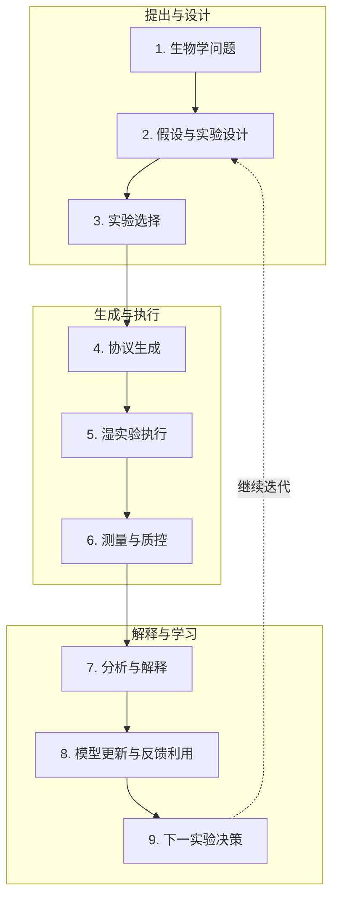

<!--
  Awesome Autonomous Biology · Chinese README editorial shell for v0.2.

  Integration contract:
  - Editorial sections outside AAB:* markers are maintained by humans.
  - Statistics and the resource list inside AAB:* markers are generated from the canonical dataset.
  - Do not hard-code counts that can be computed from data.
  - Publishing links were resolved from config/project.yml during repository integration.
-->

<p align="center">
  
</p>

<h1 align="center">Awesome Autonomous Biology</h1>

<p align="center">
  <strong>从生物学问题，到由新证据支持的下一轮实验。</strong><br />
  系统收录闭环生物学发现中的自主系统、科学智能体、模型、协议、实验室、数据集、标准、硬件与社区。
</p>

<p align="center">
  <a href="https://awesome.re"></a>
  
  
  <a href="#持续更新机制"></a>
  <a href="#审核与参与贡献"></a>
  <a href="LICENSE"></a>
  <a href="LICENSE-DATA"></a>
</p>

<p align="center">
  <a href="https://HSZD-Team.github.io/Awesome-Autonomous-Biology/"><strong>🧭 动态观测站</strong></a> ·
  <a href="#五大导航支柱与-21-类资源图谱"><strong>🗺️ 资源图谱</strong></a> ·
  <a href="#九阶段干湿闭环"><strong>🧬 闭环导航</strong></a> ·
  <a href="#gold-seed-v02"><strong>🌱 Gold Seed</strong></a> ·
  <a href="#持续更新机制"><strong>📡 最新雷达</strong></a> ·
  <a href="#审核与参与贡献"><strong>🤝 参与贡献</strong></a>
</p>

<p align="center"><a href="README.md">English</a> · <strong>简体中文</strong></p>

> [!IMPORTANT]
> **automation ≠ scientific autonomy；inclusion ≠ endorsement。** 科学自治与操作自治分别标注。被收录只表示该资源有助于完成闭环中的一个或多个环节，不代表能力背书，也不重新授权任何第三方内容。

## 这个项目是什么？

**Awesome Autonomous Biology** 是一个 biology-specific、closed-loop、evidence-graded、可审计的领域入口。它关注生物学如何从一个科学问题走到“由新证据支持的下一轮实验”，并把生信原生的计算智能与实验设计、协议、湿实验执行、测量、反馈学习和可复现基础设施连接起来。

它不是泛 AI Agent、泛实验室自动化或机器人大全，也不会因为一个项目“用了 AI”或“控制了机器人”，就把它描述成端到端自主科学家。

本项目始终追问：

> **这个资源如何帮助生物学发现闭环完成观察、推理、决策、执行、学习或迭代？证据是什么？**

### 收录边界

| 核心收录 | 作为闭环基础设施收录 | 通常不收录 |
|---|---|---|
| 生物学中的 lab-in-the-loop 与 self-driving laboratory | 与实验选择直接连接的生物基础模型 | 通用文献总结与科学写作工具 |
| 能提出假设、选择实验、分析反馈或规划下一轮的科学 Agent | 协议、LabOS、机器人、云实验室与仪器接口 | 不参与闭环的通用聊天机器人 |
| 自适应、序贯、贝叶斯或多目标生物实验设计 | 标准、溯源、模拟器、Skills、MCP 与工具适配器 | 与实验无连接的一次性预测模型 |
| 多轮扰动、蛋白/序列、细胞、药物与合成生物学流程 | 开源硬件和具有实质闭环价值的自动化设施 | 与生物学无关的通用机器人控制 |
| 闭环实验数据、优化轨迹、负结果与评测基准 | 领域课程、会议、社区和商业平台 | 只有营销主张、没有可核查来源的项目 |

边界资源只有在其与自主生物学闭环的关系明确，并且有一手论文、官方代码、数据、标准或平台页面支撑时才会收录。

## 九阶段干湿闭环



九阶段是信息组织模型，不要求单个资源覆盖完整闭环。协议语言可能只支持一环；一个自驱动实验室可能连接大部分环节。README 与网站都必须忠实显示这种差异。

## 图谱如何组织

每个资源同时拥有两层结构：

1. 一个稳定的**主分类**，回答“它是什么资源？”
2. 一组跨分类标签，回答“它在何处、以什么方式发挥作用？”——包括闭环阶段、资源类型、生物领域、湿实验状态、开放程度、证据等级、双自治等级、审核状态与最后核验时间。

为便于导航，21 类目录归入五个支柱。视觉和产品形态可以演进，类别 ID 与数据语义保持稳定。

## 五大导航支柱与 21 类资源图谱

### 🧭 I. 发现与定义 · Discover & Define

| # | 一级目录 | 主要收录内容 | 典型信号 / 关键词 |
|---:|---|---|---|
| 1 | **Surveys & Perspectives** | 综述、观点、路线图与领域定义 | `self-driving laboratory` · `AI for automated science` · `biofoundry review` |
| 2 | **End-to-End Autonomous Biology Systems** | 跨越多个闭环环节的完整系统与代表性系统案例 | robot scientist · autonomous protein engineering · closed-loop biology |
| 3 | **Scientific Agents for Biology** | 提出假设、选择实验、分析结果、规划下一轮或协调专业 Agent 的系统 | `AI scientist` · `bio-agent` · `multi-agent system` |

### 🧠 II. 决策与设计 · Decide & Design

| # | 一级目录 | 主要收录内容 | 典型信号 / 关键词 |
|---:|---|---|---|
| 4 | **Biological Experiment Design** | 主动学习、贝叶斯优化、最优实验设计、批量选择与多目标优化 | `active learning` · `Bayesian optimization` · `batch selection` |
| 5 | **Perturbation & Virtual Cell** | 基因/药物扰动、细胞状态预测、虚拟细胞与 CRISPR screen 设计 | `Perturb-seq` · `virtual cell` · `perturbation modeling` |
| 6 | **Protein & Sequence Engineering** | 蛋白、抗体、酶、DNA/RNA 与调控元件的闭环设计 | `directed evolution` · `protein design` · `sequence active learning` |
| 7 | **Drug Discovery & Cell-Based Screening** | 表型筛选、组合药物、剂量优化、ADMET 与高通量筛选 | `phenotypic screening` · `drug combination` · `HTS` |
| 8 | **Synthetic Biology & Biofoundries** | 自动化构建、菌株/代谢工程、DBTL 流程和 biofoundry 平台 | `DBTL` · `strain engineering` · `biofoundry` |

### 🧪 III. 执行与运转 · Execute & Operate

| # | 一级目录 | 主要收录内容 | 典型信号 / 关键词 |
|---:|---|---|---|
| 9 | **Protocol Generation & Representation** | 协议生成、SOP 解析、协议语言、DSL 与机器可读描述 | `Autoprotocol` · `protocol generation` · `SOP parsing` |
| 10 | **Laboratory Orchestration & LabOS** | 工作流编排、任务/资源管理、异常恢复与实验追踪 | `MADSci` · `HELAO` · `Aquarium` · workflow scheduler |
| 11 | **Robotic & Instrument Control** | 液体工作站、机械臂、显微镜、培养与分析仪器控制 | `Opentrons` · `PyLabRobot` · `SiLA` · robotic arm |
| 12 | **Measurement, QC & Data Analysis** | 测序、成像、质谱、流式、自动质控与结构化分析 | sequencing QC · image analysis · automated assay QC |

### 📈 IV. 学习与评估 · Learn & Evaluate

| # | 一级目录 | 主要收录内容 | 典型信号 / 关键词 |
|---:|---|---|---|
| 13 | **Feedback Learning & Model Updating** | 依据新实验更新模型、候选排序、记忆与决策策略 | online learning · surrogate updating · feedback utilization |
| 14 | **Data Standards & Provenance** | 样本、设备、协议、结果、元数据、互操作与溯源标准 | `FAIR` · `ISA-Tab` · `SBOL` · provenance |
| 15 | **Simulators & Digital Twins** | 虚拟实验室、机器人/设备模拟器、生物过程模型与代理环境 | digital twin · virtual laboratory · surrogate environment |
| 16 | **Benchmarks & Evaluation** | 评测 Agent、实验设计、协议、执行、反馈、成本与科学有效性 | efficiency · success rate · cost · scientific validity |
| 17 | **Datasets from Closed-Loop Experiments** | 多轮实验数据、优化轨迹、失败实验、负结果与筛选数据 | active-learning trajectory · negative result · screening data |

### 🔌 V. 构建与连接 · Build & Connect

| # | 一级目录 | 主要收录内容 | 典型信号 / 关键词 |
|---:|---|---|---|
| 18 | **Agent Skills, MCP & Tool Adapters** | 让 Agent 调用生物数据库、生信工具、工作流和设备的接口 | BioSkills · MCP server · API wrapper · tool adapter |
| 19 | **Open Hardware** | 开源移液、培养、成像、微流控、DIY 显微镜与机器人 | open pipetting · microfluidics · open microscopy |
| 20 | **Cloud Labs & Commercial Platforms** | 云实验室、自动化实验服务、商业 LabOS 与 biofoundry | cloud lab · remote experiment · commercial LabOS |
| 21 | **Tutorials, Courses & Communities** | 教程、课程、会议、workshop、论坛与社区入口 | SDL course · lab automation workshop · community forum |

## Gold Seed v0.2

Gold Seed v0.2 由现有 50 条种子与第二批 50 条一手来源调研候选组成。**100 是研究记录总数，不是 verified 数量。** 新候选先进入 `review_pending`；只有人工复核身份、边界、链接、证据与自治标注后，才能进入正式 Curated Atlas。

<!-- AAB:STATS:START -->
**100 是研究记录总数，不是已人工核验数量。** 当前为 44 条 `verified`、56 条 `review_pending`、0 条 `archived`。

数据版本 **v0.2** · 21 类覆盖 **21/21** · resource class **5** 种 · 涉及湿实验 **53** 条 · 年份未断言 **25** 条 · 最近一次 verified 核验 **2026-07-18** · 数据生成日期 **2026-07-19**。

证据等级：A **58** · B **28** · C **14**。

| # | 一级目录 | 英文名称 | 记录数 |
|---:|---|---|---:|
| 1 | 综述、观点与路线图 | Surveys & Perspectives | 4 |
| 2 | 端到端自主生物学系统 | End-to-End Autonomous Biology Systems | 7 |
| 3 | 生物学科学智能体 | Scientific Agents for Biology | 6 |
| 4 | 生物实验设计 | Biological Experiment Design | 4 |
| 5 | 扰动建模与虚拟细胞 | Perturbation & Virtual Cell | 5 |
| 6 | 蛋白与序列工程 | Protein & Sequence Engineering | 6 |
| 7 | 药物发现与细胞筛选 | Drug Discovery & Cell-Based Screening | 4 |
| 8 | 合成生物学与生物铸造厂 | Synthetic Biology & Biofoundries | 5 |
| 9 | 实验协议生成与表示 | Protocol Generation & Representation | 4 |
| 10 | 实验室编排与 LabOS | Laboratory Orchestration & LabOS | 5 |
| 11 | 机器人与仪器控制 | Robotic & Instrument Control | 4 |
| 12 | 测量、质控与数据分析 | Measurement, QC & Data Analysis | 4 |
| 13 | 反馈学习与模型更新 | Feedback Learning & Model Updating | 4 |
| 14 | 数据标准与溯源 | Data Standards & Provenance | 4 |
| 15 | 模拟器与数字孪生 | Simulators & Digital Twins | 4 |
| 16 | 基准与评测 | Benchmarks & Evaluation | 6 |
| 17 | 闭环实验数据集 | Datasets from Closed-Loop Experiments | 4 |
| 18 | Agent 技能、MCP 与工具适配器 | Agent Skills, MCP & Tool Adapters | 5 |
| 19 | 开放硬件 | Open Hardware | 5 |
| 20 | 云实验室与商业平台 | Cloud Labs & Commercial Platforms | 6 |
| 21 | 教程、课程与社区 | Tutorials, Courses & Communities | 4 |
<!-- AAB:STATS:END -->

## Resource Card 与 Autonomy Passport

每个条目都有一张通用 **Resource Card（资源档案）**：

`名称` · `主分类` · `资源类型` · `闭环阶段` · `生物领域` · `湿实验` · `论文/代码/数据/官网` · `开放状态` · `许可证` · `证据等级` · `审核状态` · `最后核验时间`

系统与科学决策模块额外获得 **Autonomy Passport（自主性档案）**，避免把基础设施错误地评分为一个完整的自主科学家。

| 维度 | 数据分级 | 核心问题 |
|---|---|---|
| **Scientific Autonomy** | `none` → `assisted` → `partial` → `high` | 谁决定下一步科学行动？ |
| **Operational Autonomy** | `none` → `assisted` → `partial` → `high` | 谁真正执行实验，能否连续运行？ |
| **Evidence Grade** | `A` / `B` / `C` | 主张由什么一手证据支撑？ |

不适用时标为 `not_applicable`；无法核实时保持保守，不做推断。

## Awesome 清单

以下清单必须由 canonical dataset 确定性生成，按 21 个主分类组织，并显示审核状态。推荐排序为：`verified` 在前、`review_pending` 在后；同状态下按年份降序、标题升序。

<!-- AAB:RESOURCE_LIST:START -->
### 综述、观点与路线图

- **[Autonomous ‘self-driving’ laboratories: a review of technology and policy implications](https://pubmed.ncbi.nlm.nih.gov/40852582/)** — 系统梳理自驱动实验室技术，并将工程能力与治理、政策和社会影响区分开来。<br>
  _EN: A recent review that separates self-driving-lab technologies from their governance, policy, and societal implications._<br>
  年份 2025 · 状态 **verified** · 证据 A · 科学自治 not_applicable · 操作自治 not_applicable · [Paper](https://doi.org/10.1098/rsos.250646)
- **[Perspectives for self-driving labs in synthetic biology](https://www.sciencedirect.com/science/article/pii/S0958166922002154)** — 从合成生物学视角讨论自驱动实验室如何重塑 Design–Build–Test–Learn 闭环。<br>
  _EN: A biology-specific perspective on how self-driving laboratories could reshape synthetic-biology design–build–test–learn cycles._<br>
  年份 2023 · 状态 **verified** · 证据 A · 科学自治 not_applicable · 操作自治 not_applicable · [Paper](https://doi.org/10.1016/j.copbio.2022.102881)
- **[Frontiers in biofoundry: opportunities and challenges](https://www.frontiersin.org/journals/synthetic-biology/articles/10.3389/fsybi.2025.1630026/full)** — 梳理生物铸造厂的能力、采用障碍、标准化问题及自动化生物工程机会。<br>
  _EN: A recent perspective on biofoundry capabilities, adoption barriers, standards, and opportunities for automated biological engineering._<br>
  年份 2025 · 状态 **⚠️ review_pending（待人工复核）** · 证据 A · 科学自治 not_applicable · 操作自治 not_applicable · [Paper](https://doi.org/10.3389/fsybi.2025.1630026)
- **[Building a biofoundry](https://pmc.ncbi.nlm.nih.gov/articles/PMC7998708/)** — 从能力、组织、工作流与挑战出发，系统说明如何建设面向合成生物学 DBTL 的生物铸造厂。<br>
  _EN: A practical, biology-specific guide to the capabilities, organization, workflows, and challenges involved in building a biofoundry._<br>
  年份 2021 · 状态 **⚠️ review_pending（待人工复核）** · 证据 A · 科学自治 not_applicable · 操作自治 not_applicable · [Paper](https://doi.org/10.1093/synbio/ysaa026)

### 端到端自主生物学系统

- **[LUMI-lab](https://www.cell.com/cell/abstract/S0092-8674%2826%2900099-1)** — 面向 mRNA 递送用可离子化脂质迭代发现的基础模型驱动自主实验室。<br>
  _EN: A foundation-model-driven autonomous laboratory for iterative discovery of ionizable lipids for mRNA delivery._<br>
  年份 2026 · 状态 **verified** · 证据 A · 科学自治 high · 操作自治 high · [Paper](https://doi.org/10.1016/j.cell.2026.01.012) · [Code](https://github.com/bowenli-lab/LUMI-lab) · [Data](https://github.com/bowenli-lab/LUMI-lab/tree/main/mapping_table)
- **[Generalized AI-powered autonomous enzyme engineering platform](https://www.nature.com/articles/s41467-025-61209-y)** — 连接 AI 设计、工作列表生成、机器人执行、检测与迭代学习的通用自主酶工程流程。<br>
  _EN: A generalized autonomous enzyme-engineering workflow linking AI-guided design, worklist generation, robotic execution, assays, and iterative learning._<br>
  年份 2025 · 状态 **verified** · 证据 A · 科学自治 high · 操作自治 high · [Paper](https://doi.org/10.1038/s41467-025-61209-y) · [Code](https://github.com/Zhao-Group/Primer_Design_and_Worklists) · [Data](https://zenodo.org/records/15243671) · [Official](https://ibiofoundry.illinois.edu/)
- **[BacterAI](https://www.nature.com/articles/s41564-023-01376-0)** — 将微生物代谢问题转化为机器人实验，并通过迭代学习得到可解释规则的自动化平台。<br>
  _EN: An automated platform that turns microbial-metabolism questions into robot-executed experiments and iteratively learns interpretable rules._<br>
  年份 2023 · 状态 **verified** · 证据 A · 科学自治 high · 操作自治 high · [Paper](https://doi.org/10.1038/s41564-023-01376-0) · [Code](https://github.com/jensenlab/BacterAI) · [Data](https://github.com/jensenlab/BacterAI/tree/master/published_data)
- **[Robot Scientist Adam / The Automation of Science](https://www.science.org/doi/10.1126/science.1165620)** — 机器人科学家早期里程碑，可在酵母功能基因组学中提出并检验假设。<br>
  _EN: A landmark robot scientist that generated and tested functional-genomics hypotheses in yeast._<br>
  年份 2009 · 状态 **verified** · 证据 B · 科学自治 high · 操作自治 high · [Paper](https://doi.org/10.1126/science.1165620)
- **[PLMeAE](https://www.nature.com/articles/s41467-025-56751-8)** — 以蛋白语言模型设计突变体，并连接生物铸造厂 Build/Test 环节的自动蛋白进化平台。<br>
  _EN: A protein-language-model-enabled automatic evolution platform connecting mutant design with biofoundry build-and-test operations._<br>
  年份 2025 · 状态 **⚠️ review_pending（待人工复核）** · 证据 A · 科学自治 high · 操作自治 high · [Paper](https://doi.org/10.1038/s41467-025-56751-8) · [Code](https://github.com/HICAI-ZJU/PLMeAE)
- **[SAMPLE](https://www.nature.com/articles/s44286-023-00002-4)** — SAMPLE 将智能实验选择与基因合成、蛋白表达和酶活测量自动化连接，执行自主的蛋白序列—功能探索。<br>
  _EN: Self-driving Autonomous Machines for Protein Landscape Exploration integrates an intelligent agent with robotic gene synthesis, expression, and activity measurement._<br>
  年份 2024 · 状态 **⚠️ review_pending（待人工复核）** · 证据 B · 科学自治 high · 操作自治 high · [Paper](https://doi.org/10.1038/s44286-023-00002-4) · [Data](https://pmc.ncbi.nlm.nih.gov/articles/PMC10926838/)
- **[BioAutomata](https://www.nature.com/articles/s41467-019-13189-z)** — 将贝叶斯实验选择与 iBioFAB 机器人执行连接起来，用完整 DBTL 循环优化番茄红素生物合成。<br>
  _EN: A fully automated design–build–test–learn platform that paired Bayesian experiment selection with iBioFAB execution to optimize lycopene biosynthesis._<br>
  年份 2019 · 状态 **⚠️ review_pending（待人工复核）** · 证据 B · 科学自治 high · 操作自治 high · [Paper](https://doi.org/10.1038/s41467-019-13189-z) · [Official](https://ibiofoundry.illinois.edu/)

### 生物学科学智能体

- **[Robin](https://www.nature.com/articles/s41586-026-10652-y)** — 在完整发现任务中自动完成文献研究、假设生成与计算分析的多智能体系统。<br>
  _EN: A multi-agent system that automates literature research, hypothesis generation, and computational analysis across a scientific-discovery campaign._<br>
  年份 2026 · 状态 **verified** · 证据 A · 科学自治 partial · 操作自治 none · [Paper](https://doi.org/10.1038/s41586-026-10652-y) · [Code](https://github.com/Future-House/robin) · [Official](https://www.futurehouse.org/research/demonstrating-end-to-end-scientific-discovery-with-robin-a-multi-agent-system)
- **[Biomni](https://biomni.stanford.edu/)** — 可规划分析并调用大量生物工具与数据库的通用生物医学 Agent 环境。<br>
  _EN: A general-purpose biomedical agent environment that plans analyses and calls a broad collection of biological tools and databases._<br>
  年份 2025 · 状态 **verified** · 证据 B · 科学自治 assisted · 操作自治 none · [Paper](https://www.biorxiv.org/content/10.1101/2025.05.30.656746v1) · [Code](https://github.com/snap-stanford/biomni) · [Official](https://biomni.stanford.edu/)
- **[BioDiscoveryAgent](https://arxiv.org/abs/2405.17631)** — 可调用工具来提出、执行计算分析并迭代生物学发现流程的 LLM Agent。<br>
  _EN: A tool-using LLM agent for proposing, executing computational analyses, and refining biological discovery workflows._<br>
  年份 2024 · 状态 **verified** · 证据 B · 科学自治 partial · 操作自治 none · [Paper](https://arxiv.org/abs/2405.17631) · [Code](https://github.com/snap-stanford/BioDiscoveryAgent)
- **[CRISPR-GPT](https://www.nature.com/articles/s41551-025-01463-z)** — 辅助研究者完成 CRISPR 设计、试剂选择、协议规划和下游分析的 LLM Agent。<br>
  _EN: An LLM-based agent that assists researchers with CRISPR design choices, reagent selection, protocol planning, and downstream analysis._<br>
  年份 2025 · 状态 **⚠️ review_pending（待人工复核）** · 证据 A · 科学自治 assisted · 操作自治 none · [Paper](https://doi.org/10.1038/s41551-025-01463-z) · [Code](https://github.com/cong-lab/crispr-gpt-pub)
- **[The Virtual Lab](https://www.nature.com/articles/s41586-025-09442-9)** — 由多个专业 Agent 讨论并形成纳米抗体设计方案，随后由研究团队进行实验验证。<br>
  _EN: A multi-agent scientific team that generated and debated nanobody design hypotheses, with selected designs subsequently tested experimentally._<br>
  年份 2025 · 状态 **⚠️ review_pending（待人工复核）** · 证据 A · 科学自治 partial · 操作自治 none · [Paper](https://doi.org/10.1038/s41586-025-09442-9) · [Code](https://github.com/zou-group/virtual-lab)
- **[CellAgent](https://www.biorxiv.org/content/10.1101/2024.05.13.593861v4)** — 可规划并执行单细胞与空间组学计算分析的多 Agent 框架。<br>
  _EN: A multi-agent framework that plans and executes computational single-cell and spatial-omics analyses._<br>
  年份 2024 · 状态 **⚠️ review_pending（待人工复核）** · 证据 B · 科学自治 partial · 操作自治 none · [Paper](https://arxiv.org/abs/2407.09811) · [Code](https://github.com/liu-shiqiang/CellAgent) · [Official](https://cell.jinyi.space/)

### 生物实验设计

- **[LaMBO](https://arxiv.org/abs/2203.12742)** — 用于多目标生物序列设计的潜空间贝叶斯优化方法。<br>
  _EN: A latent-space Bayesian-optimization method for multi-objective biological sequence design._<br>
  年份 2022 · 状态 **verified** · 证据 B · 科学自治 partial · 操作自治 none · [Paper](https://arxiv.org/abs/2203.12742) · [Code](https://github.com/samuelstanton/lambo)
- **[BRADSHAW](https://pmc.ncbi.nlm.nih.gov/articles/PMC7292824/)** — 面向小数据条件下信息增益实验选择的闭环贝叶斯优化框架。<br>
  _EN: A closed-loop Bayesian optimization framework for designing informative experiments under small-data constraints._<br>
  年份 2019 · 状态 **verified** · 证据 B · 科学自治 partial · 操作自治 none · [Paper](https://doi.org/10.1007/s10822-019-00234-8)
- **[Bayesian optimization for iterative cell-culture media development](https://www.nature.com/articles/s41467-025-61113-5)** — 以贝叶斯优化迭代选择培养基配方，加速 PBMC 维持及其他细胞培养场景的介质开发。<br>
  _EN: An iterative Bayesian-optimization workflow for accelerating cell-culture media development, including PBMC maintenance and process applications._<br>
  年份 2025 · 状态 **⚠️ review_pending（待人工复核）** · 证据 B · 科学自治 partial · 操作自治 assisted · [Paper](https://doi.org/10.1038/s41467-025-61113-5)
- **[METIS](https://www.nature.com/articles/s41467-022-31245-z)** — 面向复杂无细胞体系，以主动学习选择高信息量实验并迭代优化的框架。<br>
  _EN: An active-learning framework for efficiently selecting informative biological experiments and optimizing complex cell-free systems._<br>
  年份 2022 · 状态 **⚠️ review_pending（待人工复核）** · 证据 A · 科学自治 partial · 操作自治 assisted · [Paper](https://doi.org/10.1038/s41467-022-31245-z) · [Code](https://github.com/amirpandi/METIS) · [Data](https://github.com/amirpandi/METIS)

### 扰动建模与虚拟细胞

- **[Compositional Perturbation Autoencoder (CPA)](https://link.springer.com/article/10.15252/msb.202211517)** — 预测细胞对未见扰动组合、剂量与协变量响应的组合式单细胞模型。<br>
  _EN: A compositional model for predicting single-cell responses to unseen combinations of perturbations, doses, and covariates._<br>
  年份 2023 · 状态 **verified** · 证据 A · 科学自治 partial · 操作自治 none · [Paper](https://doi.org/10.15252/msb.202211517) · [Code](https://github.com/theislab/CPA)
- **[GEARS](https://www.nature.com/articles/s41587-023-01905-6)** — 用于预测未见遗传扰动转录响应的图模型。<br>
  _EN: A graph-based model for predicting transcriptional responses to unseen genetic perturbations._<br>
  年份 2023 · 状态 **verified** · 证据 A · 科学自治 partial · 操作自治 none · [Paper](https://doi.org/10.1038/s41587-023-01905-6) · [Code](https://github.com/snap-stanford/GEARS)
- **[CellOracle](https://www.nature.com/articles/s41586-022-05688-9)** — 从单细胞数据重建基因调控网络，并模拟转录因子扰动影响的框架。<br>
  _EN: A single-cell framework for reconstructing gene-regulatory networks and simulating transcription-factor perturbations._<br>
  年份 2023 · 状态 **⚠️ review_pending（待人工复核）** · 证据 A · 科学自治 partial · 操作自治 none · [Paper](https://doi.org/10.1038/s41586-022-05688-9) · [Code](https://github.com/morris-lab/CellOracle) · [Official](https://morris-lab.github.io/CellOracle.documentation/)
- **[CellOT](https://www.nature.com/articles/s41592-023-01969-x)** — 利用神经最优传输预测单细胞群体在扰动后如何迁移到新状态。<br>
  _EN: A neural optimal-transport model that predicts how single-cell populations change under perturbation._<br>
  年份 2023 · 状态 **⚠️ review_pending（待人工复核）** · 证据 A · 科学自治 partial · 操作自治 none · [Paper](https://doi.org/10.1038/s41592-023-01969-x) · [Code](https://github.com/bunnech/cellot)
- **[scGen](https://www.nature.com/articles/s41592-019-0494-8)** — 用于跨条件预测不同细胞类型扰动响应的生成式单细胞模型。<br>
  _EN: A generative single-cell model for predicting cell-type-specific responses to perturbations across conditions._<br>
  年份 2019 · 状态 **⚠️ review_pending（待人工复核）** · 证据 A · 科学自治 partial · 操作自治 none · [Paper](https://doi.org/10.1038/s41592-019-0494-8) · [Code](https://github.com/theislab/scgen)

### 蛋白与序列工程

- **[EVOLVEpro](https://www.science.org/doi/10.1126/science.adr6006)** — 结合序列模型与多轮实验反馈来优选变体的蛋白工程框架。<br>
  _EN: A protein-engineering framework that combines sequence models with iterative experimental feedback to prioritize variants._<br>
  年份 2025 · 状态 **verified** · 证据 A · 科学自治 partial · 操作自治 assisted · [Paper](https://doi.org/10.1126/science.adr6006) · [Code](https://github.com/mat10d/EvolvePro)
- **[Low-N protein engineering](https://pubmed.ncbi.nlm.nih.gov/33828272/)** — 在测量数据有限时优选蛋白变体的实用小数据机器学习流程。<br>
  _EN: A practical small-data machine-learning workflow for prioritizing protein variants with limited measurements._<br>
  年份 2021 · 状态 **verified** · 证据 A · 科学自治 partial · 操作自治 assisted · [Paper](https://doi.org/10.1038/s41592-021-01100-y) · [Code](https://github.com/churchlab/low-N-protein-engineering)
- **[Machine-learning-assisted directed protein evolution (MLDE)](https://www.pnas.org/doi/10.1073/pnas.1901979116)** — 以机器学习指导构建紧凑且高信息量变体库的定向进化策略。<br>
  _EN: A machine-learning-guided strategy for selecting compact, informative variant libraries for directed evolution._<br>
  年份 2019 · 状态 **verified** · 证据 A · 科学自治 partial · 操作自治 assisted · [Paper](https://doi.org/10.1073/pnas.1901979116) · [Code](https://github.com/fhalab/MLDE)
- **[MULTI-evolve](https://www.science.org/doi/10.1126/science.aea1820)** — 以少量实验测量和蛋白语言模型指导复杂多突变体设计，加速定向进化搜索。<br>
  _EN: A machine-learning-guided framework for rapidly identifying high-performing multi-mutant proteins from compact experimental measurements._<br>
  年份 2026 · 状态 **⚠️ review_pending（待人工复核）** · 证据 A · 科学自治 partial · 操作自治 assisted · [Paper](https://doi.org/10.1126/science.aea1820) · [Code](https://github.com/ArcInstitute/MULTI-evolve) · [Official](https://arcinstitute.org/news/multi-evolve)
- **[Machine-learning-guided cell-free enzyme engineering](https://www.nature.com/articles/s41467-024-55399-0)** — 整合无细胞 DNA 组装、表达、功能测定与机器学习设计的高通量酶工程平台。<br>
  _EN: A high-throughput platform integrating cell-free DNA assembly, expression, functional assays, and machine-learning-guided enzyme design._<br>
  年份 2025 · 状态 **⚠️ review_pending（待人工复核）** · 证据 B · 科学自治 partial · 操作自治 assisted · [Paper](https://doi.org/10.1038/s41467-024-55399-0)
- **[MODIFY](https://www.nature.com/articles/s41467-024-50698-y)** — 在兼顾进化合理性、多样性与预测适应度的条件下设计组合蛋白库的机器学习方法。<br>
  _EN: A machine-learning method for designing diverse, evolutionarily plausible protein libraries while co-optimizing predicted fitness._<br>
  年份 2024 · 状态 **⚠️ review_pending（待人工复核）** · 证据 A · 科学自治 partial · 操作自治 assisted · [Paper](https://doi.org/10.1038/s41467-024-50698-y) · [Code](https://github.com/luo-group/MODIFY)

### 药物发现与细胞筛选

- **[Quadratic Phenotypic Optimization Platform (QPOP)](https://www.science.org/doi/10.1126/scitranslmed.aan0941)** — 以表型数据驱动高效搜索和优化多药组合的平台。<br>
  _EN: A phenotype-driven platform for efficiently searching and optimizing multidrug combinations._<br>
  年份 2018 · 状态 **verified** · 证据 B · 科学自治 partial · 操作自治 assisted · [Paper](https://doi.org/10.1126/scitranslmed.aan0941)
- **[Robot Scientist Eve](https://royalsocietypublishing.org/rsif/article/12/104/20141289/35592/Cheaper-faster-drug-development-validated-by-the)** — 自动开展表型筛选并为被忽视疾病发现候选化合物的机器人科学家。<br>
  _EN: A robot scientist that automated phenotypic screening and identified candidate compounds for neglected-disease drug discovery._<br>
  年份 2015 · 状态 **verified** · 证据 B · 科学自治 high · 操作自治 high · [Paper](https://doi.org/10.1098/rsif.2014.1289)
- **[BATCHIE](https://www.nature.com/articles/s41467-024-55287-7)** — 为大规模药物组合筛选动态选择批次，并依据实验结果持续更新的贝叶斯主动学习平台。<br>
  _EN: A Bayesian active-learning platform that dynamically selects batches for large drug-combination screens and updates from observed results._<br>
  年份 2025 · 状态 **⚠️ review_pending（待人工复核）** · 证据 A · 科学自治 partial · 操作自治 assisted · [Paper](https://doi.org/10.1038/s41467-024-55287-7) · [Code](https://github.com/tansey-lab/batchie) · [Official](https://batchie.readthedocs.io/)
- **[DrugReflector](https://www.science.org/doi/10.1126/science.adi8577)** — 利用转录组特征与湿实验反馈迭代排序化合物的主动学习药物发现框架。<br>
  _EN: An active-learning framework that uses transcriptomic signatures and wet-lab feedback to prioritize compounds for phenotypic drug discovery._<br>
  年份 2025 · 状态 **⚠️ review_pending（待人工复核）** · 证据 A · 科学自治 partial · 操作自治 assisted · [Paper](https://doi.org/10.1126/science.adi8577) · [Code](https://github.com/Cellarity/drugreflector) · [Data](https://zenodo.org/records/17437512)

### 合成生物学与生物铸造厂

- **[NSF iBioFoundry (iBioFAB)](https://ibiofoundry.illinois.edu/)** — 为合成生物学 Design–Build–Test–Learn 提供高自动化基础设施的生物铸造厂。<br>
  _EN: A highly automated synthetic-biology biofoundry that provides infrastructure for design–build–test–learn workflows._<br>
  年份 日期未断言 · 状态 **verified** · 证据 B · 科学自治 none · 操作自治 high · [Official](https://ibiofoundry.illinois.edu/)
- **[eVOLVER](https://pmc.ncbi.nlm.nih.gov/articles/PMC6035058/)** — 支持可编程反馈控制微生物实验的可扩展连续培养平台。<br>
  _EN: A scalable continuous-culture platform supporting programmable, feedback-controlled microbial experiments._<br>
  年份 2018 · 状态 **⚠️ review_pending（待人工复核）** · 证据 A · 科学自治 none · 操作自治 high · [Paper](https://doi.org/10.1038/nbt.4151) · [Code](https://github.com/khalil-lab/evolver) · [Official](https://www.fynchbio.com/)
- **[Agile BioFoundry](https://agilebiofoundry.org/)** — 由美国国家实验室组成，为生物制造提供集成 Design–Build–Test–Learn 能力的生物铸造联盟。<br>
  _EN: A U.S. national-laboratory consortium providing integrated design–build–test–learn capabilities for biomanufacturing._<br>
  年份 日期未断言 · 状态 **⚠️ review_pending（待人工复核）** · 证据 C · 科学自治 none · 操作自治 high · [Official](https://agilebiofoundry.org/)
- **[DAMP Lab](https://www.damplab.org/)** — 波士顿大学面向合成生物学设计、自动化、制造与流程的高通量设施。<br>
  _EN: Boston University's Design, Automation, Manufacturing, and Processes facility for high-throughput synthetic-biology workflows._<br>
  年份 日期未断言 · 状态 **⚠️ review_pending（待人工复核）** · 证据 C · 科学自治 none · 操作自治 high · [Official](https://www.bu.edu/research/core-facilities/damp/)
- **[London Biofoundry](https://www.londonbiofoundry.org/)** — 提供自动化生物设计、构建、测试与表征能力的伦敦生物铸造厂。<br>
  _EN: A biofoundry providing automated biological design, construction, testing, and characterization capabilities._<br>
  年份 日期未断言 · 状态 **⚠️ review_pending（待人工复核）** · 证据 C · 科学自治 none · 操作自治 high · [Official](https://www.londonbiofoundry.org/)

### 实验协议生成与表示

- **[LabOP](https://bioprotocols.github.io/)** — 用于跨执行环境表示、交换和编译实验协议的本体语言。<br>
  _EN: An ontology-based language for representing, exchanging, and compiling laboratory protocols across execution environments._<br>
  年份 2023 · 状态 **verified** · 证据 A · 科学自治 not_applicable · 操作自治 partial · [Paper](https://doi.org/10.1145/3604568) · [Code](https://github.com/Bioprotocols/labop) · [Official](https://bioprotocols.github.io/)
- **[BioPlanner](https://aclanthology.org/2023.emnlp-main.162/)** — 将生物协议映射为伪代码的评测框架与 BioProt 数据集，用于检验和改进 LLM 实验规划。<br>
  _EN: A protocol-planning evaluation framework and BioProt dataset that map biological protocols to pseudocode representations._<br>
  年份 2023 · 状态 **⚠️ review_pending（待人工复核）** · 证据 A · 科学自治 assisted · 操作自治 none · [Paper](https://arxiv.org/abs/2310.10632) · [Code](https://github.com/bioplanner/bioplanner) · [Data](https://github.com/bioplanner/bioplanner)
- **[BioCoder](https://pmc.ncbi.nlm.nih.gov/articles/PMC2989930/)** — 较早将生物实验协议表达为标准化、可执行代码的领域专用语言。<br>
  _EN: An early programming language for expressing biology protocols in a standardized, machine-actionable form._<br>
  年份 2010 · 状态 **⚠️ review_pending（待人工复核）** · 证据 B · 科学自治 not_applicable · 操作自治 partial · [Paper](https://doi.org/10.1186/1754-1611-4-13) · [Code](https://www.microsoft.com/en-us/download/details.aspx?id=52556) · [Official](https://www.microsoft.com/en-us/research/publication/biocoder-a-programming-language-for-standardizing-and-automating-biology-protocols/)
- **[Autoprotocol](https://autoprotocol.org/)** — 用于描述可执行实验步骤的机器可读协议规范与软件生态。<br>
  _EN: A machine-readable protocol specification and software ecosystem for describing executable laboratory procedures._<br>
  年份 日期未断言 · 状态 **⚠️ review_pending（待人工复核）** · 证据 A · 科学自治 not_applicable · 操作自治 partial · [Code](https://github.com/autoprotocol/autoprotocol-python) · [Official](https://autoprotocol.org/)

### 实验室编排与 LabOS

- **[MADSci](https://joss.theoj.org/papers/10.21105/joss.09416)** — 在自主实验室中调度工作流并协调设备、资源和数据的模块化框架。<br>
  _EN: A modular framework for scheduling workflows and coordinating devices, resources, and data in autonomous laboratories._<br>
  年份 2026 · 状态 **verified** · 证据 A · 科学自治 none · 操作自治 high · [Paper](https://doi.org/10.21105/joss.09416) · [Code](https://github.com/AD-SDL/MADSci)
- **[Aquarium](https://academic.oup.com/synbio/article/6/1/ysab006/6124325)** — 用于规划、执行、追踪和复现实验室复杂生物工作流的 LabOS。<br>
  _EN: A laboratory operating system for planning, executing, tracking, and reproducing complex biological workflows._<br>
  年份 2021 · 状态 **verified** · 证据 A · 科学自治 none · 操作自治 partial · [Paper](https://doi.org/10.1093/synbio/ysab006) · [Code](https://github.com/aquariumbio/aquarium)
- **[Antha](https://marketplace.microsoft.com/en-us/product/saas/synthace-5352101.antha?tab=overview)** — 用于编排、执行和追踪自动化生物实验工作流的商业实验室软件平台。<br>
  _EN: A commercial laboratory software platform for composing, executing, and tracking automated biological workflows._<br>
  年份 2017 · 状态 **⚠️ review_pending（待人工复核）** · 证据 C · 科学自治 none · 操作自治 high · [Official](https://theplosblog.plos.org/2017/02/antha-a-platform-for-engineering-biology/)
- **[HELAO](https://github.com/helgestein/helao-pub)** — 用于协调仪器服务与自动化实验的模块化实验室编排框架。<br>
  _EN: A modular orchestration framework for coordinating instrument servers and automated laboratory experiments._<br>
  年份 日期未断言 · 状态 **⚠️ review_pending（待人工复核）** · 证据 B · 科学自治 none · 操作自治 high · [Code](https://github.com/helgestein/helao-pub) · [Official](https://fuzhanrahmanian.com/project/helao/)
- **[Riffyn X](https://www.dex.siemens.com/plm/riffyn-x?cclcl=en_US)** — 用于结构化实验流程、连接数据与物料并保留研发溯源的商业平台。<br>
  _EN: A commercial platform for structuring experimental processes, connecting data and materials, and preserving R&D provenance._<br>
  年份 日期未断言 · 状态 **⚠️ review_pending（待人工复核）** · 证据 C · 科学自治 none · 操作自治 assisted · [Official](https://trials.sw.siemens.com/en-US/trials/riffyn-x)

### 机器人与仪器控制

- **[PyLabRobot](https://docs.pylabrobot.org/)** — 面向移液工作站及其他实验设备的硬件无关 Python 控制框架。<br>
  _EN: A hardware-agnostic Python framework for controlling liquid handlers and other laboratory devices._<br>
  年份 2023 · 状态 **verified** · 证据 A · 科学自治 none · 操作自治 partial · [Paper](https://doi.org/10.1016/j.device.2023.100111) · [Code](https://github.com/PyLabRobot/pylabrobot) · [Official](https://docs.pylabrobot.org/)
- **[SiLA 2](https://sila-standard.com/)** — 用于实验仪器互操作通信的标准与软件基础。<br>
  _EN: A standard and software base for interoperable communication with laboratory instruments._<br>
  年份 日期未断言 · 状态 **verified** · 证据 A · 科学自治 not_applicable · 操作自治 partial · [Code](https://gitlab.com/SiLA2/sila_base) · [Official](https://sila2.gitlab.io/)
- **[Micro-Manager](https://micro-manager.org/)** — 广泛使用的开源显微镜硬件控制、自动采集与成像工作流平台。<br>
  _EN: A widely used open platform for microscope hardware control, automated acquisition, and imaging workflows._<br>
  年份 2014 · 状态 **⚠️ review_pending（待人工复核）** · 证据 A · 科学自治 none · 操作自治 partial · [Paper](https://doi.org/10.14440/jbm.2014.36) · [Code](https://github.com/micro-manager/micro-manager) · [Official](https://micro-manager.org/)
- **[PyHamilton](https://github.com/dgretton/pyhamilton)** — 用于脚本化控制和协调 Hamilton 液体工作站的开源 Python 接口。<br>
  _EN: An open Python interface for scripting and coordinating Hamilton liquid-handling robots._<br>
  年份 日期未断言 · 状态 **⚠️ review_pending（待人工复核）** · 证据 B · 科学自治 none · 操作自治 partial · [Code](https://github.com/dgretton/pyhamilton)

### 测量、质控与数据分析

- **[CellProfiler](https://cellprofiler.org/)** — 广泛使用的开源生物图像高通量定量分析平台，强调可复现流程。<br>
  _EN: A widely used open platform for reproducible, high-throughput quantitative analysis of biological images._<br>
  年份 2018 · 状态 **verified** · 证据 A · 科学自治 none · 操作自治 partial · [Paper](https://doi.org/10.1371/journal.pbio.2005970) · [Code](https://github.com/CellProfiler/CellProfiler) · [Official](https://cellprofiler.org/)
- **[MCMICRO](https://www.nature.com/articles/s41592-021-01308-y)** — 将高度多重化组织图像处理为可分析空间数据的模块化、可复现计算流程。<br>
  _EN: A modular, reproducible computational pipeline for processing highly multiplexed tissue images into analysis-ready spatial data._<br>
  年份 2022 · 状态 **⚠️ review_pending（待人工复核）** · 证据 A · 科学自治 none · 操作自治 partial · [Paper](https://doi.org/10.1038/s41592-021-01308-y) · [Code](https://github.com/labsyspharm/mcmicro) · [Official](https://mcmicro.org/)
- **[DeepCell Kiosk](https://www.nature.com/articles/s41592-020-01023-0)** — 将细胞图像深度学习分析部署为可操作测量服务的系统。<br>
  _EN: A deployable deep-learning system that makes cell-image analysis accessible as an operational measurement service._<br>
  年份 2020 · 状态 **⚠️ review_pending（待人工复核）** · 证据 B · 科学自治 none · 操作自治 high · [Paper](https://doi.org/10.1038/s41592-020-01023-0) · [Code](https://github.com/vanvalenlab/deepcell-kiosk) · [Official](https://deepcell.org/)
- **[DeepCell](https://www.nature.com/articles/nmeth.3890)** — 面向细胞图像分割与定量分析的开源深度学习库和工具生态。<br>
  _EN: An open deep-learning library and ecosystem for cellular image segmentation and quantitative analysis._<br>
  年份 2016 · 状态 **⚠️ review_pending（待人工复核）** · 证据 A · 科学自治 none · 操作自治 partial · [Paper](https://doi.org/10.1038/nmeth.3890) · [Code](https://github.com/vanvalenlab/deepcell-tf) · [Official](https://www.deepcell.org/)

### 反馈学习与模型更新

- **[Active Learning-assisted Directed Evolution (ALDE)](https://www.nature.com/articles/s41467-025-55987-8)** — 在多轮定向进化实验中持续更新序列—适应度模型的主动学习流程。<br>
  _EN: An iterative active-learning workflow that updates sequence–fitness models across rounds of directed-evolution experiments._<br>
  年份 2025 · 状态 **verified** · 证据 A · 科学自治 partial · 操作自治 assisted · [Paper](https://doi.org/10.1038/s41467-025-55987-8) · [Code](https://github.com/jsunn-y/ALDE)
- **[Automated Recommendation Tool (ART)](https://www.nature.com/articles/s41467-020-18008-4)** — 从生物实验中学习并在不确定性下推荐新设计的贝叶斯集成框架。<br>
  _EN: A Bayesian ensemble framework that learns from biological experiments and recommends new designs under uncertainty._<br>
  年份 2020 · 状态 **verified** · 证据 B · 科学自治 partial · 操作自治 assisted · [Paper](https://doi.org/10.1038/s41467-020-18008-4) · [Code](https://github.com/JBEI/ART)
- **[Active-learning-guided optimization of cell-free biosensors](https://www.nature.com/articles/s41467-025-66964-6)** — 通过多目标主动学习和多轮无细胞实验，迭代优化铅检测转录因子生物传感器的灵敏度与选择性。<br>
  _EN: A multi-objective active-learning workflow that iteratively engineered cell-free transcription-factor biosensors for sensitive and selective lead detection._<br>
  年份 2026 · 状态 **⚠️ review_pending（待人工复核）** · 证据 B · 科学自治 partial · 操作自治 assisted · [Paper](https://doi.org/10.1038/s41467-025-66964-6) · [Data](https://www.nature.com/articles/s41467-025-66964-6)
- **[OPEX](https://www.nature.com/articles/s41467-020-18785-y)** — 用主动学习选择高信息量组学实验，以更少测量持续改善预测模型的最优实验设计方法。<br>
  _EN: An optimal experimental-design method that uses active learning to select informative omics experiments and improve models with fewer measurements._<br>
  年份 2020 · 状态 **⚠️ review_pending（待人工复核）** · 证据 B · 科学自治 partial · 操作自治 assisted · [Paper](https://doi.org/10.1038/s41467-020-18785-y) · [Data](https://www.ncbi.nlm.nih.gov/geo/query/acc.cgi?acc=GSE144604)

### 数据标准与溯源

- **[ISA-Tab and ISA tools](https://isa-tools.org/)** — 用于组织生命科学 Investigation、Study、Assay 与溯源元数据的标准和工具生态。<br>
  _EN: A standards and tooling ecosystem for structuring investigation, study, assay, and provenance metadata in life science._<br>
  年份 日期未断言 · 状态 **verified** · 证据 A · 科学自治 not_applicable · 操作自治 not_applicable · [Paper](https://pmc.ncbi.nlm.nih.gov/articles/PMC8444265/) · [Code](https://github.com/ISA-tools) · [Official](https://isa-tools.org/)
- **[Synthetic Biology Open Language Version 3 (SBOL 3)](https://sbolstandard.org/)** — 用于表达工程生物系统结构、功能和设计意图的开放标准。<br>
  _EN: An open standard for representing the structure, function, and design intent of engineered biological systems._<br>
  年份 2020 · 状态 **⚠️ review_pending（待人工复核）** · 证据 A · 科学自治 not_applicable · 操作自治 not_applicable · [Paper](https://doi.org/10.3389/fbioe.2020.01009) · [Code](https://github.com/SynBioDex) · [Official](https://sbolstandard.org/)
- **[Allotrope Framework and Allotrope Data Format](https://www.allotrope.org/allotrope-framework)** — 标准化分析实验室数据、元数据与语义的框架和数据格式。<br>
  _EN: A framework and data format for standardizing analytical laboratory data, metadata, and semantics._<br>
  年份 日期未断言 · 状态 **⚠️ review_pending（待人工复核）** · 证据 B · 科学自治 not_applicable · 操作自治 not_applicable · [Official](https://docs.allotrope.org/Allotrope%20Data%20Format.html)
- **[OME-NGFF](https://ngff.openmicroscopy.org/)** — 用于存储和互操作访问大规模多维生物成像数据的开放云原生规范。<br>
  _EN: An open, cloud-native specification for storing and interoperably accessing large multidimensional bioimaging data._<br>
  年份 日期未断言 · 状态 **⚠️ review_pending（待人工复核）** · 证据 A · 科学自治 not_applicable · 操作自治 not_applicable · [Code](https://github.com/ome/ngff) · [Official](https://ngff.openmicroscopy.org/latest/)

### 模拟器与数字孪生

- **[BioSimulators](https://biosimulators.org/)** — 支持生物模型可复现仿真的注册表与标准化执行生态。<br>
  _EN: A registry and standardized execution ecosystem for reproducible simulation of biological models._<br>
  年份 2022 · 状态 **verified** · 证据 A · 科学自治 not_applicable · 操作自治 not_applicable · [Paper](https://doi.org/10.1093/nar/gkac331) · [Code](https://github.com/biosimulators) · [Official](https://biosimulators.org/)
- **[Vivarium](https://academic.oup.com/bioinformatics/article/38/7/1972/6522109)** — 将异构生物模型组合为多尺度仿真的框架。<br>
  _EN: A framework for composing heterogeneous biological models into multiscale simulations._<br>
  年份 2022 · 状态 **verified** · 证据 A · 科学自治 not_applicable · 操作自治 not_applicable · [Paper](https://doi.org/10.1093/bioinformatics/btac049) · [Code](https://github.com/vivarium-collective/vivarium-core)
- **[COBRApy](https://opencobra.github.io/cobrapy/)** — 用于代谢网络约束建模、重建与仿真的主流开源 Python 库。<br>
  _EN: A widely used open Python library for constraint-based reconstruction and simulation of metabolic networks._<br>
  年份 2013 · 状态 **⚠️ review_pending（待人工复核）** · 证据 A · 科学自治 not_applicable · 操作自治 not_applicable · [Paper](https://pmc.ncbi.nlm.nih.gov/articles/PMC3751080/) · [Code](https://github.com/opencobra/cobrapy) · [Official](https://opencobra.github.io/cobrapy/)
- **[CellModeller](https://cellmodeller.github.io/CellModeller/)** — 用于模拟多细胞微生物系统生长、力学与遗传回路的个体级建模框架。<br>
  _EN: An open framework for individual-based modeling of multicellular microbial systems, growth, mechanics, and genetic circuits._<br>
  年份 日期未断言 · 状态 **⚠️ review_pending（待人工复核）** · 证据 A · 科学自治 not_applicable · 操作自治 not_applicable · [Paper](https://doi.org/10.1021/sb300031n) · [Code](https://github.com/cellmodeller/CellModeller) · [Official](https://cellmodeller.github.io/CellModeller/)

### 基准与评测

- **[Virtual Cell Challenge](https://virtualcellchallenge.org/)** — 用于评测细胞扰动响应预测模型的社区挑战与数据生态。<br>
  _EN: A community challenge and dataset ecosystem for evaluating models that predict cellular responses to perturbations._<br>
  年份 2025 · 状态 **verified** · 证据 B · 科学自治 not_applicable · 操作自治 not_applicable · [Paper](https://www.cell.com/cell/fulltext/S0092-8674%2825%2900675-0) · [Data](https://virtualcellchallenge.org/datasets) · [Official](https://virtualcellchallenge.org/)
- **[ProteinGym](https://proteingym.org/)** — 利用实验测得适应度景观评测蛋白序列模型的大型基准套件。<br>
  _EN: A large evaluation suite for protein-sequence models using experimentally measured fitness landscapes._<br>
  年份 2023 · 状态 **verified** · 证据 A · 科学自治 not_applicable · 操作自治 not_applicable · [Paper](https://pubmed.ncbi.nlm.nih.gov/38106144/) · [Code](https://github.com/OATML-Markslab/ProteinGym) · [Data](https://proteingym.org/) · [Official](https://proteingym.org/)
- **[LABBench2](https://arxiv.org/abs/2604.09554)** — 在近 1,900 个生物研究任务上评测 AI 推理与实验相关技能的基准套件。<br>
  _EN: A benchmark suite for evaluating AI systems on nearly 1,900 biology-research tasks across reasoning and laboratory-relevant skills._<br>
  年份 2026 · 状态 **⚠️ review_pending（待人工复核）** · 证据 B · 科学自治 not_applicable · 操作自治 not_applicable · [Paper](https://arxiv.org/abs/2604.09554) · [Code](https://github.com/EdisonScientific/labbench2) · [Data](https://huggingface.co/datasets/EdisonScientific/labbench2)
- **[scPerturBench](https://doi.org/10.1038/s41592-025-02980-0)** — 跨多数据集与未见场景评测单细胞扰动响应预测方法泛化能力的可复现基准。<br>
  _EN: A reproducible benchmark of methods for generalizable single-cell perturbation-response prediction across diverse datasets and scenarios._<br>
  年份 2025 · 状态 **⚠️ review_pending（待人工复核）** · 证据 A · 科学自治 not_applicable · 操作自治 not_applicable · [Paper](https://doi.org/10.1038/s41592-025-02980-0) · [Code](https://github.com/bm2-lab/scPerturBench) · [Data](https://bm2-lab.github.io/scPerturBench-reproducibility/) · [Official](https://bm2-lab.github.io/scPerturBench-reproducibility/)
- **[FLIP](https://openreview.net/forum?id=p2dMLEwL8tF)** — 通过更贴近真实蛋白工程使用场景的数据切分，评测适应度景观模型的基准套件。<br>
  _EN: A benchmark suite with realistic data splits for evaluating machine-learning models on protein fitness landscapes._<br>
  年份 2021 · 状态 **⚠️ review_pending（待人工复核）** · 证据 A · 科学自治 not_applicable · 操作自治 not_applicable · [Paper](https://openreview.net/forum?id=p2dMLEwL8tF) · [Code](https://github.com/J-SNACKKB/FLIP) · [Data](https://github.com/J-SNACKKB/FLIP/tree/main/splits)
- **[Therapeutics Data Commons](https://tdcommons.ai/)** — 汇集药物研发数据集、任务、标准切分、评估器和排行榜的开放基准生态。<br>
  _EN: An open ecosystem of AI-ready therapeutic datasets, tasks, data splits, evaluators, and leaderboards._<br>
  年份 2021 · 状态 **⚠️ review_pending（待人工复核）** · 证据 A · 科学自治 not_applicable · 操作自治 not_applicable · [Paper](https://datasets-benchmarks-proceedings.neurips.cc/paper/2021/hash/4c56ff4ce4aaf9573aa5dff913df997a-Abstract-round1.html) · [Code](https://github.com/mims-harvard/TDC) · [Data](https://tdcommons.ai/) · [Official](https://tdcommons.ai/)

### 闭环实验数据集

- **[LUMI-lab iterative LNP design data](https://github.com/bowenli-lab/LUMI-lab/tree/main/mapping_table)** — LUMI-lab 可离子化脂质迭代设计与测试产生的数据和映射表。<br>
  _EN: Data and mapping tables from iterative ionizable-lipid design and testing in LUMI-lab._<br>
  年份 2026 · 状态 **verified** · 证据 A · 科学自治 not_applicable · 操作自治 not_applicable · [Paper](https://doi.org/10.1016/j.cell.2026.01.012) · [Data](https://github.com/bowenli-lab/LUMI-lab/tree/main/mapping_table)
- **[BacterAI autonomous-experiment dataset](https://github.com/jensenlab/BacterAI/tree/master/published_data)** — BacterAI 多轮微生物代谢实验的公开数据，可用于研究主动学习轨迹。<br>
  _EN: Published data from BacterAI’s iterative microbial-metabolism experiments, suitable for studying active-learning trajectories._<br>
  年份 2023 · 状态 **verified** · 证据 A · 科学自治 not_applicable · 操作自治 not_applicable · [Paper](https://doi.org/10.1038/s41564-023-01376-0) · [Data](https://github.com/jensenlab/BacterAI/tree/master/published_data)
- **[BATCHIE prospective combination-screen data](https://www.nature.com/articles/s41467-024-55287-7)** — BATCHIE 儿童肿瘤药物组合筛选中形成的序贯实验测量与主动学习轨迹。<br>
  _EN: Prospective sequential drug-combination measurements associated with BATCHIE's pediatric-cancer screening campaign._<br>
  年份 2025 · 状态 **⚠️ review_pending（待人工复核）** · 证据 B · 科学自治 not_applicable · 操作自治 not_applicable · [Paper](https://doi.org/10.1038/s41467-024-55287-7) · [Code](https://github.com/tansey-lab/batchie) · [Data](https://www.nature.com/articles/s41467-024-55287-7) · [Official](https://batchie.readthedocs.io/)
- **[SAMPLE autonomous protein-engineering campaign data](https://pmc.ncbi.nlm.nih.gov/articles/PMC10926838/)** — SAMPLE 自主蛋白适应度景观探索中形成的论文关联测量结果与设计历史。<br>
  _EN: Publication-linked measurements and design history from SAMPLE's autonomous protein-landscape exploration campaigns._<br>
  年份 2024 · 状态 **⚠️ review_pending（待人工复核）** · 证据 B · 科学自治 not_applicable · 操作自治 not_applicable · [Paper](https://doi.org/10.1038/s44286-023-00002-4) · [Data](https://pmc.ncbi.nlm.nih.gov/articles/PMC10926838/)

### Agent 技能、MCP 与工具适配器

- **[ToolUniverse](https://zitniklab.hms.harvard.edu/ToolUniverse/)** — 为 Agent 工作流提供一千余种科研资源接口的大型科学工具生态。<br>
  _EN: A large scientific tool ecosystem that exposes more than a thousand research resources for agentic workflows._<br>
  年份 2025 · 状态 **verified** · 证据 B · 科学自治 assisted · 操作自治 none · [Paper](https://arxiv.org/abs/2509.23426) · [Code](https://github.com/mims-harvard/ToolUniverse) · [Official](https://zitniklab.hms.harvard.edu/ToolUniverse/)
- **[BioMCP](https://biomcp.org/)** — 让 Agent 以结构化方式访问可信生物医学来源的 MCP 与命令行接口。<br>
  _EN: An MCP and command-line interface that gives agents structured access to trusted biomedical sources._<br>
  年份 日期未断言 · 状态 **verified** · 证据 A · 科学自治 not_applicable · 操作自治 assisted · [Code](https://github.com/genomoncology/biomcp) · [Official](https://biomcp.org/)
- **[BioChatter](https://biochatter.org/)** — 用于构建可复现、能连接生物医学工具与知识图谱的对话式 AI 应用的开放框架。<br>
  _EN: An open framework for building reproducible conversational-AI applications grounded in biomedical tools and knowledge graphs._<br>
  年份 2025 · 状态 **⚠️ review_pending（待人工复核）** · 证据 A · 科学自治 assisted · 操作自治 none · [Paper](https://pmc.ncbi.nlm.nih.gov/articles/PMC12216031/) · [Code](https://github.com/biocypher/biochatter) · [Official](https://biochatter.org/)
- **[BioThings Explorer](https://explorer.biothings.io/)** — 将带语义标注的生物医学 API 动态串联为联邦知识图谱查询的引擎。<br>
  _EN: A query engine that dynamically chains semantically annotated biomedical APIs into a federated knowledge graph._<br>
  年份 2023 · 状态 **⚠️ review_pending（待人工复核）** · 证据 A · 科学自治 not_applicable · 操作自治 assisted · [Paper](https://doi.org/10.1093/bioinformatics/btad570) · [Code](https://github.com/biothings/biothings_explorer) · [Official](https://explorer.biothings.io/)
- **[gget](https://gget.bio/)** — 以命令行和 Python API 统一访问基因组参考数据库及常用分析服务的工具包。<br>
  _EN: A command-line and Python toolkit that provides programmatic access to genomic reference databases and common analysis services._<br>
  年份 2023 · 状态 **⚠️ review_pending（待人工复核）** · 证据 A · 科学自治 not_applicable · 操作自治 assisted · [Paper](https://doi.org/10.1093/bioinformatics/btac836) · [Code](https://github.com/scverse/gget) · [Official](https://gget.bio/)

### 开放硬件

- **[Chi.Bio](https://chi.bio/)** — 用于自动化连续培养实验的开源联网生物反应器平台。<br>
  _EN: An open-source, networked bioreactor platform for automated continuous-culture experiments._<br>
  年份 2020 · 状态 **verified** · 证据 A · 科学自治 none · 操作自治 high · [Paper](https://doi.org/10.1371/journal.pbio.3000794) · [Code](https://github.com/HarrisonSteel/ChiBio) · [Official](https://chi.bio/)
- **[OpenFlexure Microscope](https://openflexure.org/)** — 可作为自动化生物流程成像与测量终端的开放式电动显微镜平台。<br>
  _EN: An open, motorized microscope platform that can serve as an imaging and measurement endpoint in automated biology workflows._<br>
  年份 2020 · 状态 **verified** · 证据 A · 科学自治 none · 操作自治 partial · [Paper](https://pmc.ncbi.nlm.nih.gov/articles/PMC7249832/) · [Code](https://github.com/rwb27/openflexure_microscope) · [Official](https://openflexure.org/)
- **[Opentrons OT-2](https://github.com/Opentrons/ot2)** — 广泛用于生物自动化的可编程移液机器人，公开官方硬件文件和软件栈。<br>
  _EN: A programmable liquid-handling robot with official hardware files and an open software stack used across biological automation._<br>
  年份 日期未断言 · 状态 **verified** · 证据 A · 科学自治 none · 操作自治 high · [Code](https://github.com/Opentrons/opentrons) · [Official](https://opentrons.com/)
- **[Poseidon syringe-pump and microscope system](https://pachterlab.github.io/poseidon/)** — 面向微流控实验、结合可编程注射泵与显微镜的低成本开放系统。<br>
  _EN: A low-cost open system combining programmable syringe pumps and microscopy for microfluidic laboratory experiments._<br>
  年份 2019 · 状态 **⚠️ review_pending（待人工复核）** · 证据 A · 科学自治 none · 操作自治 partial · [Paper](https://pmc.ncbi.nlm.nih.gov/articles/PMC6711986/) · [Code](https://github.com/pachterlab/poseidon) · [Official](https://pachterlab.github.io/poseidon/about)
- **[OpenDrop digital microfluidics](https://www.gaudi.ch/OpenDrop/)** — 通过可编程液滴操作支持个人化生物自动化应用的开放数字微流控平台。<br>
  _EN: An open digital-microfluidics platform for programming droplet operations and developing personal bioautomation applications._<br>
  年份 2017 · 状态 **⚠️ review_pending（待人工复核）** · 证据 B · 科学自治 none · 操作自治 partial · [Paper](https://pmc.ncbi.nlm.nih.gov/articles/PMC5590459/) · [Official](https://www.gaudi.ch/OpenDrop/)

### 云实验室与商业平台

- **[Arctoris Ulysses](https://www.arctoris.com/)** — 以 Ulysses 自动化栈为核心的商业机器人药物发现实验室平台。<br>
  _EN: A commercial robotic drug-discovery laboratory platform centered on its Ulysses automation stack._<br>
  年份 日期未断言 · 状态 **verified** · 证据 C · 科学自治 assisted · 操作自治 high · [Official](https://www.arctoris.com/about-us/)
- **[Culture Biosciences](https://www.culturebiosciences.com/)** — 用于远程生物工艺开发与数据采集的商业云连接生物反应器平台。<br>
  _EN: A commercial cloud-connected bioreactor platform for remote bioprocess development and data collection._<br>
  年份 日期未断言 · 状态 **verified** · 证据 C · 科学自治 none · 操作自治 high · [Official](https://www.culturebiosciences.com/)
- **[Emerald Cloud Lab](https://www.emeraldcloudlab.com/)** — 用户可通过云端软件定义并运行实验的商业远程实验室。<br>
  _EN: A commercial remote laboratory where users specify and run experiments through a cloud software interface._<br>
  年份 日期未断言 · 状态 **verified** · 证据 C · 科学自治 assisted · 操作自治 high · [Official](https://www.emeraldcloudlab.com/how-it-works/run/)
- **[Ginkgo Bioworks autonomous labs and foundry platform](https://www.ginkgo.bio/solutions)** — 以服务形式提供自动化并逐步增强自主能力的商业生物工程铸造平台。<br>
  _EN: A commercial biological-engineering foundry offering automated and increasingly autonomous laboratory capabilities as a service._<br>
  年份 日期未断言 · 状态 **⚠️ review_pending（待人工复核）** · 证据 C · 科学自治 assisted · 操作自治 high · [Official](https://www.ginkgo.bio/)
- **[LabGenius EVA](https://labgeniustx.com/)** — 面向多特异性抗体迭代发现与优化、连接机器学习和自动实验的专有平台。<br>
  _EN: A proprietary machine-learning and automated-experimentation platform for iterative discovery and optimization of multispecific antibodies._<br>
  年份 日期未断言 · 状态 **⚠️ review_pending（待人工复核）** · 证据 B · 科学自治 partial · 操作自治 high · [Paper](https://pmc.ncbi.nlm.nih.gov/articles/PMC12688275/) · [Official](https://labgeniustx.com/)
- **[Strateos cloud laboratory](https://www.prnewswire.com/news-releases/eli-lilly-and-company-in-collaboration-with-strateos-inc-launch-remote-controlled-robotic-cloud-lab-300984067.html)** — 允许用户远程定义并运行生命科学实验的商业机器人云实验室平台。<br>
  _EN: A commercial robotic cloud-laboratory platform for remotely specifying and running life-science experiments._<br>
  年份 日期未断言 · 状态 **⚠️ review_pending（待人工复核）** · 证据 C · 科学自治 none · 操作自治 high · [Official](https://go.strateos.com/hubfs/Website%20URLs/Media%20Kit/Strateos_CompanyFactSheet_Oct2021%20V2.pdf)

### 教程、课程与社区

- **[Global Biofoundries Alliance](https://www.biofoundries.org/)** — 连接全球生物铸造厂并推动能力共享、标准与合作的国际联盟。<br>
  _EN: An international alliance connecting biofoundries and promoting shared capabilities, standards, and collaboration._<br>
  年份 日期未断言 · 状态 **verified** · 证据 C · 科学自治 not_applicable · 操作自治 not_applicable · [Official](https://www.biofoundries.org/about)
- **[Lab Automation Forums](https://labautomation.io/)** — 面向实验室自动化、系统集成、故障排查与实践知识共享的从业者社区。<br>
  _EN: A practitioner community for laboratory automation, integration, troubleshooting, and shared implementation knowledge._<br>
  年份 日期未断言 · 状态 **verified** · 证据 C · 科学自治 not_applicable · 操作自治 not_applicable · [Official](https://labautomation.io/t/welcome-to-lab-automation-forums/7)
- **[International Workshop on Bio-Design Automation (IWBDA)](https://www.iwbdaconf.org/)** — 连接合成生物学、设计自动化、标准、软件工具与实验执行的长期 workshop 社区。<br>
  _EN: A long-running workshop community connecting synthetic biology with design automation, standards, tools, and laboratory execution._<br>
  年份 日期未断言 · 状态 **⚠️ review_pending（待人工复核）** · 证据 C · 科学自治 not_applicable · 操作自治 not_applicable · [Official](https://www.iwbdaconf.org/2022/)
- **[Society for Laboratory Automation and Screening (SLAS)](https://www.slas.org/)** — 连接实验室自动化、筛选、仪器和生命科学技术实践者的专业学会与会议生态。<br>
  _EN: A professional society and conference ecosystem for laboratory automation, screening, instrumentation, and applied life-science technology._<br>
  年份 日期未断言 · 状态 **⚠️ review_pending（待人工复核）** · 证据 C · 科学自治 not_applicable · 操作自治 not_applicable · [Official](https://www.slas.org/)
<!-- AAB:RESOURCE_LIST:END -->

## 探索动态观测站

GitHub README 是稳定入口；GitHub Pages 是可筛选、可追踪、可分享的领域观测站。所有视图必须由与 README 同源的结构化数据生成。

| 视图 | 作用 |
|---|---|
| **Atlas** | 在 21 类资源中搜索与多维筛选，并区分 verified / review_pending |
| **Loop Map** | 按九阶段干湿闭环探索资源及能力缺口 |
| **Radar** | 查看每日发现的论文、代码、数据、标准与平台更新 |
| **Timeline** | 追踪代表性系统、版本发布与领域转折点 |
| **Project Dossiers** | 阅读含来源、边界说明、自治标注和变更记录的资源档案 |
| **Ecosystem Graph** | 探索资源、方法、实验室、机构、生物领域与闭环阶段的关系 |
| **Digest** | 阅读每周新增、升级、降级、归档与值得关注的变化 |
| **Methods** | 查看收录规则、Schema、证据等级、更新方法与数据溯源 |

> 网站视觉改版与本轮内容扩充解耦：先保证数据、状态与生成逻辑正确，再依据选定的视觉参考做独立改版。

## 持续更新机制

项目严格区分“自动发现”与“正式认可”：

| 频率 | 信息流 | 自动化内容 | 可发布状态 |
|---|---|---|---|
| 每日 | **Radar** | API/RSS 采集、规范化、稳定 ID、去重、链接检查、候选构建 | `unverified` / `review_pending` |
| 每周 | **Curation Queue** | 候选排序、证据包、差异摘要；受限 LLM 仅可起草字段 | `review_pending` |
| 人工审核后 | **Curated Atlas** | Schema 校验、来源核验、PR 审批与变更记录 | `verified` |
| 每月 / 正式版本 | **Snapshot** | 数据导出、变更日志、覆盖报告与可引用归档 | `released` |

第一版不需要一个拥有写权限的通用 Agent。GitHub Actions 与确定性采集器承担主流程；如果以后加入 curator Agent，它也不能虚构条目、合并自己的 PR，或把 Radar 候选自动升级为 `verified`。

## 审核与参与贡献

项目追求覆盖度、证据、可追溯性与长期价值，而不是 Star 排名或机械堆长列表。一个正式 Atlas 条目至少需要：

- 与生物学发现闭环的明确关系；
- 一个主分类与至少一个闭环阶段；
- 一手论文、官方代码、数据、标准或项目页面；
- 对湿实验、开放程度、双自治和证据强度的保守标注；
- 审核者、判断说明与 `last_verified`；
- 对容易被误读为“端到端自治”的边界说明。

社区可以推荐资源、修正元数据、补充一手来源、质疑分类、报告撤稿或停止维护，也可以认领类别维护。正式条目只通过结构化数据修改，再自动渲染到 README 与网站。

## 仓库蓝图

```text
awesome-autonomous-biology/
├── README.md                     # 英文入口；编辑内容 + 生成区域
├── README_zh.md                  # 中文入口；编辑内容 + 生成区域
├── data/
│   ├── gold-seed-v0.2.yml        # canonical dataset，100 条研究记录
│   ├── review-flags.yml          # 待复核项与原因
│   ├── radar/                    # 自动发现、尚未正式核验的候选
│   └── releases/                 # 版本化快照
├── schemas/                      # Resource / Source JSON Schema
├── site/                         # GitHub Pages 静态网站
├── scripts/                      # 采集、规范化、去重、校验与渲染
├── docs/                         # 范围、量表、方法、贡献和更新说明
└── .github/workflows/            # CI、Radar、审核队列与 Pages 部署
```

实际目录以仓库现状为准；不要为匹配这张示意图而破坏已经工作的构建结构。

## 本地探索与维护

- **Website：** 启用 GitHub Pages 后访问项目站点；按仓库脚本运行本地开发服务器。
- **Generate：** `pnpm generate` 从 canonical dataset 更新 README 生成区域与网站数据。
- **Validate：** Schema、ID、URL、重复项、枚举值与双语字段必须在 CI 中校验。
- **Build：** 推送前执行现有测试与 production build。
- **Contributing：** 参见 [`CONTRIBUTING.md`](CONTRIBUTING.md) 与 [`CURATION.md`](CURATION.md)。
- **Citation：** 参见 [`CITATION.cff`](CITATION.cff)。

## 路线图

- [x] **V0 — 范围与 Schema：** 固化 21 类目录、九阶段闭环、资源类与证据规则
- [x] **V0.1 — 首批 Gold Seed：** 形成 50 条来源调研记录并完成首轮链接审计
- [ ] **V0.2 — 扩展与复核：** 合并第二批 50 条，完成去重、链接审计与人工升级
- [ ] **V1 — 精选发布：** 发布经过人工核验的双语目录与第一个可引用快照
- [ ] **V2 — 动态观测站：** 完善 Atlas、Loop Map、Radar、Timeline、Dossiers 与 Graph
- [ ] **V3 — 持续更新：** 稳定每日发现、每周审核包、链接监测与更新溯源

## 引用与许可证

首个稳定快照将提供数据版本、CITATION.cff 与 BibTeX。在此之前，请引用仓库 URL、版本号并注明访问日期。

- 原创代码：**MIT License**；
- 原创策展元数据与双语摘要：**CC BY 4.0**；
- 第三方论文、代码、数据、标准、硬件、商标及其许可证仍归原权利人所有。

---

<p align="center"><strong>🧬 Observe → Reason → Design → Execute → Measure → Learn → Repeat</strong></p>

<p align="center">
  <a href="https://HSZD-Team.github.io/Awesome-Autonomous-Biology/">网站</a> ·
  <a href="https://github.com/HSZD-Team/Awesome-Autonomous-Biology/issues">推荐资源</a> ·
  <a href="https://github.com/HSZD-Team/Awesome-Autonomous-Biology/discussions">参与讨论</a>
</p>
